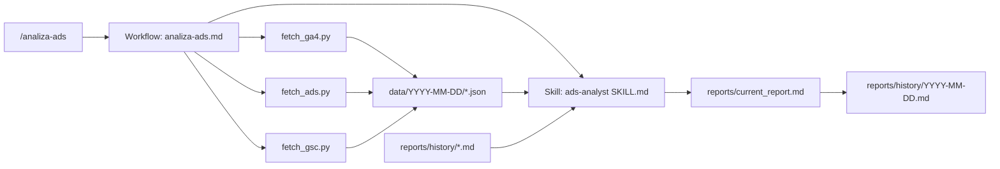

# Walkthrough — Agent Audytu Marketingowego

## Co zostało zrobione

Stworzono kompletną infrastrukturę agenta do dwutygodniowego audytu kampanii marketingowych.

### Stworzone pliki

| Plik | Rola |
|---|---|
| [utils.py](file:///home/wales/projects/agents/illuminart-ads/scripts/utils.py) | Wspólne funkcje: OAuth2 auth, settings, CLI args, JSON I/O |
| [fetch_ga4.py](file:///home/wales/projects/agents/illuminart-ads/scripts/fetch_ga4.py) | Pobieranie z GA4: ruch, źródła, konwersje, top strony |
| [fetch_ads.py](file:///home/wales/projects/agents/illuminart-ads/scripts/fetch_ads.py) | Pobieranie z Google Ads: kampanie, keywords, search terms, change history |
| [fetch_gsc.py](file:///home/wales/projects/agents/illuminart-ads/scripts/fetch_gsc.py) | Pobieranie z GSC: zapytania, strony, trend dzienny |
| [SKILL.md](file:///home/wales/projects/agents/illuminart-ads/skills/ads-analyst/SKILL.md) | Prompt eksperta — metodologia analizy i format raportu |
| [analiza-ads.md](file:///home/wales/projects/agents/illuminart-ads/workflows/analiza-ads.md) | Workflow orkiestracji — 6 kroków od danych do raportu |
| [settings.yaml](file:///home/wales/projects/agents/illuminart-ads/config/settings.yaml) | Template konfiguracji (property IDs, tokens) |
| [requirements.txt](file:///home/wales/projects/agents/illuminart-ads/scripts/requirements.txt) | Zależności Python |
| [.gitignore](file:///home/wales/projects/agents/illuminart-ads/.gitignore) | Ochrona credentials i danych surowych |
| [README.md](file:///home/wales/projects/agents/illuminart-ads/README.md) | Instrukcja setup krok-po-kroku |

### Architektura

### Kluczowe decyzje architektoniczne

1. **OAuth2 Desktop flow** dla wszystkich 3 API — jeden zestaw credentials
2. **Dane per run** w `data/{YYYY-MM-DD}/` — pełna historia źródłowa
3. **Jeden prompt z wszystkimi danymi** (nie łańcuch) — przy małej skali danych to optymalne
4. **Skill + Workflow separation** — Skill to "mózg" (ekspertyza), Workflow to "ręce" (orkiestracja)
5. **Automatyczne flagowanie wasted spend** już na etapie skryptów (pole `is_wasted` w JSON)

## Weryfikacja

- ✅ Składnia Python — wszystkie 4 skrypty poprawne
- ✅ Struktura projektu — 12 plików w poprawnej hierarchii
- ⏳ Test z prawdziwymi danymi — wymaga konfiguracji GCP

## Następne kroki (wymagane od Ciebie)

> [!IMPORTANT]
> **Kolejność działań:**
>
> 1. **Skonfiguruj Google Cloud** — postępuj wg instrukcji w [README.md](file:///home/wales/projects/agents/illuminart-ads/README.md#konfiguracja-google-cloud)
> 2. **Uzupełnij `config/settings.yaml`** — property ID, customer ID, site URL
> 3. **Zainstaluj zależności**: `python3 -m venv .venv && source .venv/bin/activate && pip install -r scripts/requirements.txt`
> 4. **Uruchom test**: `python3 scripts/fetch_ga4.py --help` (sprawdzi import + CLI)
> 5. **Pierwszy pełny test**: uruchom `/analiza-ads` w IDE

> [!WARNING]
> **Developer Token Google Ads** — uzyskanie tokenu może zająć czas. Możesz zacząć od testowania GA4 i GSC (te działają od razu po OAuth2 setup).
