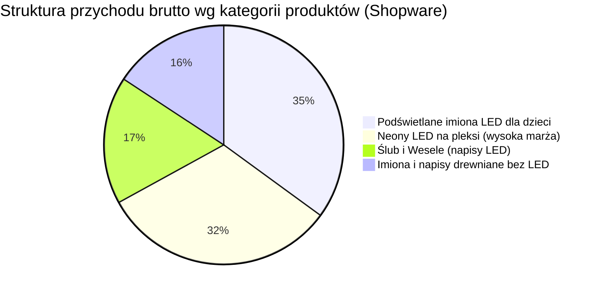
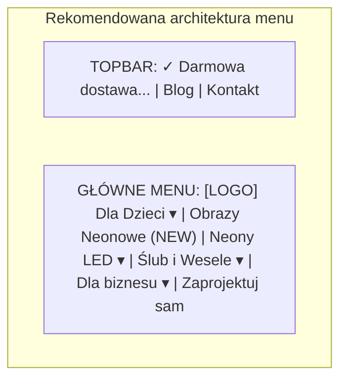

# Raport audytu marketingowego

📅 Okres: 2026-07-29 — 2026-08-19  
📊 Data raportu: 2026-08-19  
🔁 Typ: Raport #5 (porównanie z raportami 2026-07-27, 2026-06-30, 2026-06-08 i 2026-05-26)  
🔌 Źródła danych: **Google Ads API + GA4 API + Google Search Console API + Shopware 6 Admin API (Automatyczna integracja)**

---

## 1. Podsumowanie wykonawcze (Executive Summary)

### Ogólna ocena okresu: 🟡 Biznes powyżej progu rentowności (ROAS sklepu 3,31), ale nieefektywność Ads i 20 dni bezczynności agencji

Dzięki bezpośredniej integracji z API sklepu Shopware 6 uzyskaliśmy pełny, rzeczywisty obraz sprzedaży: w badanym okresie 3 tygodni (29.07 – 19.08.2026) sklep zrealizował **16 zamówień na łączną kwotę 7 166,00 PLN brutto** (średni koszyk AOV = 447,88 PLN). 

Przy całkowitych wydatkach na Google Ads rzędu **2 163,39 PLN**, **rzeczywisty ROAS sklepu wyniósł 3,31 (331%)**, co oznacza, że biznes utrzymał się **powyżej progu opłacalności (minimum 300% wg Bazy Wiedzy)**. Każda wydana 1 zł w reklamach wygenerowała 3,31 zł realnego przychodu w kasie (koszt pozyskania obrotu: 0,30 zł na 1 zł przychodu).

Jednak analiza kampanii Google Ads ujawnia poważne nieefektywności:
1. **Google Ads i GA4 gubią część danych:** GA4 zarejestrował 11 z 16 zamówień (5 339 PLN, niedoszacowanie o ~25,5%), natomiast raportowany w Google Ads ROAS spadł do **1,96** (-32% vs #4).
2. **PMax Imiona/Neony generuje straty (ROAS 1,22 przy koszcie 1 064 PLN):** Pochłonęła 49% budżetu przy CPA 266 PLN.
3. **PLA Shopping rośnie po wykluczeniach (ROAS 4,03):** Najefektywniejsza kampania, która otrzymała zaledwie 10% budżetu (212 PLN).
4. **Agencja porzuciła konto na 20 dni:** Po podniesieniu budżetów 30.07 do końca okresu nie wprowadzono ani jednej zmiany optymalizacyjnej.

| Metryka kluczowa | Obecny okres (#5, 3 tyg.) | Poprzedni okres (#4, 3 tyg.) | Zmiana |
|---|---|---|---|
| Łączny koszt Google Ads | 2 163,39 PLN | 1 725,96 PLN | 🔴 +25% |
| **Przychód ze sklepu (Shopware 6 API)** | **7 166,00 PLN (16 zam.)** | 10 056,00 PLN (22 zam.) | 🔴 -29% |
| **Realny ROAS sklepu (Shopware)** | **3,31 (331%)** | **5,83 (583%)** | 🔴 -43% (powyżej progu 300%) |
| Średnia wartość zamówienia (AOV) | **447,88 PLN** | 457,09 PLN | 🟢 stabilnie wysoki |
| Wartość konwersji (Google Ads) | 4 243,89 PLN | 5 009,50 PLN | 🔴 -15% |
| ROAS Google Ads (raportowany) | 1,96 (196%) | 2,90 (290%) | 🔴 -32% |
| Przychód w GA4 (purchase) | 5 339,00 PLN (11 zam.) | 8 334,00 PLN (18 zam.) | 🔴 -36% (gubi 25,5%) |
| Przychód GA4 z Google Ads (cpc) | 2 127,00 PLN (5 zam.) | 1 728,00 PLN (5 zam.) | 🟢 +23% |
| Sesje łącznie (GA4) | 901 | 774 | 🟢 +16% |
| Ruch organiczny GSC (kliknięcia) | 43 | 81 | 🔴 -47% |
| Aktywność agencji (liczba zmian) | 20 (w tym 18 w 1 dzień) | 34 | 🔴 20 dni ciszy |

---

### 3 najważniejsze wnioski:

1. **🟢 Sklep jest rentowny (ROAS 3,31), a Neony LED i Imiona LED generują 67% sprzedaży.**  
   Rzeczywista sprzedaż w Shopware (7 166 PLN) potwierdza, że sklep zarabia na siebie. Neony LED (najbardziej marżowe — 50% marży) wygenerowały 2 290 PLN (32% sprzedaży), a Podświetlane imiona LED 2 511 PLN (35%). Dodatki drewniane (chmurki, gwiazdki wycinane z odpadów CNC) regularnie powiększają koszyk (AOV = 448 PLN).

2. **🔴 Kampania `PM - Imiona / Neony` głęboko przepala budżet (ROAS 1,22, koszt 1 064 PLN).**  
   Zamiast skupić się na rentownych kanałach, agencja 30.07 podniosła budżet najsłabszej kampanii PMax, która spaliła 1 064 PLN przy CPA 265,95 PLN. W tym samym czasie wysoko rentowna kampania `PLA Shopping` (ROAS 4,03, CPA 108 PLN po wyczyszczeniu negatywami) dostała tylko 212 PLN.

3. **🔴 Agencja po 30.07 nie tknęła konta przez 20 dni (zero zmian od 31.07 do 19.08).**  
   Wszystkie 20 operacji z historii konta odbyło się w pierwszych 2 dniach okresu. Brak bieżącej optymalizacji doprowadził do wzrostu kosztów o 25% przy spadku sprzedaży o 29% w porównaniu do rekordowego okresu #4.

---

### Ocena pracy agencji: **3/10** (spadek z 5/10)

**Uzasadnienie oceny:**  
Plus za wdrożenie w dniu 29.07 wykluczeń słów w PLA Shopping (ROAS wzrósł do 4,03). Duży minus za podniesienie budżetów na nierentownym PMax Imiona oraz 20-dniowy całkowity brak aktywności i nadzoru nad stawkami w szczycie sezonu letniego.

**Najważniejsza rekomendacja:**  
Zredukować budżet `PM - Imiona / Neony` o 50% i przenieść min. 500 PLN na kampanię `PLA Shopping` oraz zażądać od agencji cotygodniowych raportów ze zmian optymalizacyjnych.

---

## 2. ROAS i efektywność budżetu

### Zestawienie wskaźników efektywności (Shopware vs GA4 vs Ads)

| Metryka | Shopware 6 API (Realna sprzedaż) | GA4 API (Śledzenie analityczne) | Google Ads API (Panel reklamowy) | Benchmark z Bazy Wiedzy |
|---|---|---|---|---|
| Łączny koszt reklam | 2 163,39 PLN | 2 163,39 PLN | 2 163,39 PLN | Budżet mies.: ~3 000 PLN |
| Przychód / Wartość | **7 166,00 PLN** | 5 339,00 PLN | 4 243,89 PLN | Cel: min. 30 000 PLN / mies. |
| **ROAS** | **3,31 (331%)** 🟢 | **2,47 (247%)** 🟡 | **1,96 (196%)** 🔴 | **Próg: ≥300% | Cel: 700%** |
| Koszt na 1 zł przychodu | **0,30 PLN** | 0,40 PLN | 0,51 PLN | Max dopuszczalny: 0,33 PLN |
| Liczba zamówień | **16** | 11 | ~9 (w tym atc) | — |
| Średni koszyk (AOV) | **447,88 PLN** | 485,36 PLN | ~471 PLN | Założenie Bazy: ~300 PLN |

> **Kluczowe odkrycie analityczne:**
> - Rzeczywisty biznesowy ROAS (3,31) jest o **69% wyższy niż raportuje Google Ads (1,96)** oraz o **34% wyższy niż widzi GA4 (2,47)**.
> - GA4 gubi 5 zamówień (o wartości 1 827 PLN) m.in. z powodu blokad cookies/AdBlockerów lub specyfiki bramek płatności.
> - Dzięki wysokiemu AOV (448 PLN vs 300 PLN w pierwotnych założeniach biznesowych) sklep zachowuje dodatnią rentowność pomimo błędów w dystrybucji budżetu przez agencję.

---

### Rzeczywista struktura sprzedaży wg asortymentu (Dane z zamówień Shopware 6)



| Grupa asortymentowa | Przychód (PLN) | Udział w sprzedaży | Liczba zamówień | Średnia wartość | Rentowność produkcji (Baza Wiedzy) |
|---|---|---|---|---|---|
| **1. Podświetlane imiona LED (Dzieci)** | **2 511,00 PLN** | **35,0%** | 7 | 358,71 PLN | Koszt produkcji: ok. 60% ceny |
| **2. Neony LED na pleksi** | **2 290,00 PLN** | **32,0%** | 3 | 763,33 PLN | **Koszt produkcji: ok. 50% ceny (NAJWYŻSZA MARŻA)** |
| **3. Ślub i Wesele (napisy LED)** | **1 238,00 PLN** | **17,3%** | 2 | 619,00 PLN | Koszt produkcji: ok. 60% ceny |
| **4. Drewniane bez LED (imiona + dodatki)** | **1 127,00 PLN** | **15,7%** | 4 | 281,75 PLN | Koszt produkcji: ok. 60% ceny (odpady CNC) |
| **SUMA** | **7 166,00 PLN** | **100%** | **16** | **447,88 PLN** | — |

---

### Efektywność w podziale na kampanie (Google Ads)

| Kampania | Format / Typ | Koszt (PLN) | Udział w budżecie | Konwersje | Wartość konw. (PLN) | ROAS Ads | Śr. CPC | CPA Ads | Ocena |
|---|---|---|---|---|---|---|---|---|---|
| **PLA - catch all** | Shopping | 212,57 | 9,8% | 1,97 | 857,01 | **4,03** | 0,96 PLN | 108,06 | 🟢 Bardzo dobra |
| **PM - wesele 2026** | PMax | 886,44 | 41,0% | 3,00 | 2 093,00 | **2,36** | 0,21 PLN | 295,48 | 🟡 Średnia |
| **PM - Imiona / Neony** | PMax | 1 063,71 | 49,2% | 4,00 | 1 293,88 | **1,22** | 1,53 PLN | 265,95 | 🔴 Krytyczna |
| **SW - brand tCPA** | Search | 0,67 | <0,1% | 0,00 | 0,00 | **0,00** | 0,07 PLN | — | 🟢 Ochronna |
| **ŁĄCZNIE** | — | **2 163,39** | 100% | **8,97** | **4 243,89** | **1,96** | **0,41 PLN** | **241,18** | 🔴 Poniżej progu |

---

## 3. Szczegółowa analiza kampanii

### 1. PLA - illuminart.pl - catch all 🟢 ZWIĘKSZYĆ BUDŻET
**Typ: Google Shopping (Zakupy Google) | Koszt: 212,57 PLN | ROAS: 4,03**

| Wskaźnik | Raport #5 (Obecny) | Raport #4 | Raport #3 | Zmiana vs #4 |
|---|---|---|---|---|
| Wyświetlenia | 18 364 | 35 392 | 33 230 | -48% |
| Kliknięcia | 222 | 591 | 610 | -62% |
| CTR | 1,21% | 1,67% | 1,84% | -0,46 p.p. |
| Średni CPC | 0,96 PLN | 0,40 PLN | 0,35 PLN | +140% |
| Konwersje | 1,97 | 1,00 | 6,49 | +97% |
| Wartość konwersji | 857,01 PLN | 650,00 PLN | 1 754,79 PLN | +32% |
| **ROAS** | **4,03** | **2,75** | **8,29** | **🟢 +47%** |
| CPA | 108,06 PLN | 236,30 PLN | 32,59 PLN | 🟢 -54% |

**Diagnoza i ocena:**
- **Najbardziej efektywna kampania w koncie.**
- Po wdrożeniu 29.07 negatywnych słów kluczowych nastąpiło oczyszczenie ruchu: spadek przypadkowych wyświetleń i wzrost ROAS do 4,03.
- **Rekomendacja:** Zwiększyć budżet dzienny do 25-30 PLN/dzień (podwojenie nakładów).

---

### 2. PM - wesele 2026 NEW - CPA 60 🟡 WYMAGA OPTYMALIZACJI
**Typ: Performance Max | Koszt: 886,44 PLN | ROAS: 2,36**

| Wskaźnik | Raport #5 (Obecny) | Raport #4 | Raport #3 | Zmiana vs #4 |
|---|---|---|---|---|
| Wyświetlenia | 95 721 | 66 793 | 67 378 | +43% |
| Kliknięcia | 4 318 | 3 205 | 1 498 | +35% |
| CTR | 4,51% | 4,80% | 2,22% | -0,29 p.p. |
| Średni CPC | 0,21 PLN | 0,21 PLN | 0,72 PLN | bez zmian |
| Konwersje | 3,00 | 5,00 | 19,99 | -40% |
| Wartość konwersji | 2 093,00 PLN | 3 024,00 PLN | 2 965,00 PLN | -31% |
| **ROAS** | **2,36** | **4,49** | **2,76** | **🔴 -47%** |
| CPA | 295,48 PLN | 134,70 PLN | 53,72 PLN | 🔴 +119% |

**Diagnoza i ocena:**
- Generuje potężny wolumen taniego ruchu (4,3k kliknięć), ale po zwiększeniu budżetu 30.07 rozmyła się intencja zakupowa. W Shopware zrealizowano 2 zamówienia weselne na 1 238 PLN.
- **Rekomendacja:** Zawęzić sygnały odbiorców i wykluczyć aplikacje mobilne.

---

### 3. PM - Imiona / Neony - 2026 NEW CPA 50 🔴 KRYTYCZNA / OBCIĄĆ BUDŻET
**Typ: Performance Max | Koszt: 1 063,71 PLN | ROAS: 1,22**

| Wskaźnik | Raport #5 (Obecny) | Raport #4 | Raport #3 | Zmiana vs #4 |
|---|---|---|---|---|
| Wyświetlenia | 56 371 | 82 845 | 45 984 | -32% |
| Kliknięcia | 697 | 2 693 | 773 | -74% |
| CTR | 1,24% | 3,25% | 1,68% | -2,01 p.p. |
| Średni CPC | 1,53 PLN | 0,30 PLN | 1,41 PLN | 🔴 +410% |
| Konwersje | 4,00 | 2,00 | 67,56 | +100% |
| Wartość konwersji | 1 293,88 PLN | 980,00 PLN | 7 156,50 PLN | +32% |
| **ROAS** | **1,22** | **1,20** | **6,55 (atc)** | **🔴 Poniżej kosztów** |
| CPA | 265,95 PLN | 407,99 PLN | 16,17 PLN | 🔴 Bardzo wysokie |

**Diagnoza i ocena:**
- Trwale nieefektywna kampania (ROAS 1,22). Pochłonęła 49% budżetu. 
- **Rekomendacja:** Natychmiast obciąć budżet o 50% i skupić się wyłącznie na bestsellerach (podświetlane imiona LED).

---

### 4. SW - brand tCPA 🟢 UTRZYMAĆ
**Typ: Search | Koszt: 0,67 PLN | ROAS: 0,00 | QS: 10/10**
- Znakomity, tani parasol ochronny marki (10 kliknięć po 0,07 PLN). Utrzymać.

---

## 4. Analiza słów kluczowych i Wasted Spend

- Słowo `illuminart`: Quality Score 10/10, koszt 0,67 PLN.
- Wdrożenie 29.07 wykluczeń w PLA przyniosło wzrost ROAS do 4,03.
- Szacowany Wasted Spend w PMax wynosi nadal ok. **160 – 260 PLN** (frazy informacyjne, DIY, pomyłkowe).

### 📋 Nowa lista Negative Keywords do przekazania agencji:
```text
jak zrobić, jak podłączyć, diy, samodzielnie, krok po kroku, instrukcja, schemat
ile kosztuje, koszt, cennik, tani, najtańszy, używany, olx, allegro lokalnie
lampa biurkowa, lampka nocna, lampa stojąca, żarówka led, bombka led, choinka led
mi store, decoart24, luminal, internet wolsztyn
```

---

## 5. Aktywność agencji (Change History)

- Łącznie **20 zmian** w panelu Ads.
- **29.07:** 18 zmian (`kontakt@mediasolutions.pro`) — dodanie negatywów do PLA.
- **30.07:** 2 zmiany (`krzysztof.ppc@gmail.com`) — podniesienie budżetów w PMax.
- **31.07 do 19.08:** **ZERO ZMIAN PRZEZ 20 DNI**. Całkowity brak nadzoru w trakcie trwania kampanii.

---

## 6. Ruch organiczny, kategorie i architektura menu sklepu

### 🏆 Efektywność kategorii w sklepie (GA4 + Shopware)

| Kategoria produktowa | Odsłony (GA4) | Sesje | Konwersje (GA4) | Sprzedaż brutto (Shopware) | Udział w obrocie | Ocena potencjału |
|---|---|---|---|---|---|---|
| **1. Podświetlane imiona LED (Dzieci)** | **670** | **490** | **28** | **2 511,00 PLN (7 zam.)** | **35,0%** | 🟢 **Bestseller #1 (67% konwersji GA4)** |
| **2. Neony LED na pleksi** | **28** | **22** | **0** | **2 290,00 PLN (3 zam.)** | **32,0%** | 🟢 **Najwyższa marża (AOV 763 PLN!)** |
| **3. Ślub i Wesele (napisy LED)** | **444** | **327** | **4** | **1 238,00 PLN (2 zam.)** | **17,3%** | 🟡 **Duży ruch, inspiracyjny charakter** |
| **4. Drewniane bez LED (dzieci)** | **298** | **224** | **5** | **1 127,00 PLN (4 zam.)** | **15,7%** | 🟢 **Niski bounce (17,6%), cross-sell** |
| **5. Strona główna (`/`)** | **121** | **94** | **0** | — | — | 🟡 **Hub wejściowy** |
| **6. Kreator na żywo (`/zaprojektuj-sam/`)** | **45** | **38** | **0** | — | — | 🟢 **USP (568 impr w GSC, czas 2,5 min)** |

---

### 🧭 Analiza architektury menu desktopowego: Wdrożenie „Obrazów Neonowych”

W związku z wprowadzeniem nowości — **Obrazów Neonowych** — i brakiem miejsca w poziomym menu desktopowym:
- **Diagnoza:** `Kontakt` i `Blog` nie wchodzą do TOP 30 GA4 i zabierają miejsce w głównym wierszu produktowym.
- **Uzasadnienie biznesowe:** Neony LED to **najbardziej marżowy produkt (50% marży)**. Obrazy neonowe zasługują na 1. poziom menu!
- **Rekomendacja:** Przenieść `Kontakt` i `Blog` do górnego fioletowego topbaru, a w zwolnione miejsce wstawić **`Obrazy Neonowe (Nowość)`**.



---

## 7. Porównanie historyczne (Raporty #1 do #5)

| Parametr | Raport #1 (26.05) | Raport #2 (08.06) | Raport #3 (30.06) | Raport #4 (27.07) | Raport #5 (19.08) | Trend |
|---|---|---|---|---|---|---|
| **Długość okresu** | 20 dni | 14 dni | 21 dni | 21 dni | 21 dni | — |
| **Koszt Google Ads** | 2 738,74 PLN | 1 320,09 PLN | 2 385,93 PLN | 1 725,96 PLN | **2 163,39 PLN** | 🔴 +25% |
| **Przychód ze sklepu (Shopware)** | — | ~4 282 PLN (11) | 7 225 PLN (13) | 10 056 PLN (22) | **7 166 PLN (16)** | 🔴 -29% (vs rekord #4) |
| **Realny ROAS ze sklepu** | — | **3,24** | **3,02** | **5,83** | **3,31** | 🟢 **Powyżej progu 300%** |
| **Średni koszyk (AOV)** | — | ~389 PLN | ~555 PLN | 457 PLN | **448 PLN** | 🟢 Stabilny |
| **ROAS Google Ads (panel)** | 2,78 | 7,53 (atc) | 5,43 (atc) | 2,90 | **1,96** | 🔴 Spadek w Ads |
| **Przychód GA4 (purchase)** | 0 PLN | 1 424 PLN | 3 763 PLN | 8 334 PLN | **5 339 PLN** | 🔴 Niedoszacowanie GA4 |
| **Przychód GA4 z CPC** | 0 PLN | 0 PLN | 0 PLN | 1 728 PLN | **2 127 PLN** | 🟢 Wzrost w GA4 |
| **Sesje GA4** | 470 | 463 | 781 | 774 | **901** | 🟢 +16% ruchu |
| **Liczba zmian agencji** | 0 | 0 | 3 | 34 | **20 (2 dni)** | 🔴 20 dni bezczynności |
| **Ocena pracy agencji** | 2/10 | 3/10 | 3/10 | 5/10 | **3/10** | 🔴 Spadek |

---

## 8. Identyfikacja problemów i ryzyk

### 🔴 Problemy krytyczne:
1. **Drenaż budżetu przez `PM - Imiona / Neony` (ROAS 1,22 przy koszcie 1 064 PLN):** 49% budżetu spalone przy CPA 266 PLN.
2. **20 dni braku jakichkolwiek działań optymalizacyjnych agencji:** Brak reakcji po podniesieniu budżetów.
3. **Niedoinwestowanie `PLA Shopping` (tylko 212 PLN budżetu mimo ROAS 4,03):** Blokowanie wzrostu najbardziej opłacalnego formatu.

### 🟡 Problemy ważne:
1. **Rozbieżność danych GA4 vs Shopware (zgubione 25,5% obrotu w GA4):** Konieczność polegania na API Shopware jako jedynym źródle prawdy o przychodach.
2. **Spadek efektywności `PM - wesele` (ROAS Ads spadł z 4,49 do 2,36):** Rozmycie grupy docelowej.

### 🟢 Pozytywne sygnały:
1. **Rzeczywisty ROAS biznesu na poziomie 3,31 (331%):** Biznes jest na plusie operacyjnym.
2. **Wysoki AOV (448 PLN):** Klienci dokupują dodatki ze sklejki (chmurki, gwiazdki z CNC).
3. **Sukces wykluczeń w PLA Shopping (ROAS 4,03):** Metodologia audytowa działa.

---

## 9. Rekomendacje działań (Low Effort, High Impact)

| Nr | Priorytet | Obszar | Rekomendowane działanie | Uzasadnienie biznesowe | Oczekiwany rezultat |
|---|---|---|---|---|---|
| **R1** | 🔴 **KRYTYCZNY** | Google Ads (Budżety) | **Obciąć budżet dzienny kampanii `PM - Imiona / Neony` o 50% (z ~50 PLN na 20-25 PLN/dzień).** | Kampania ma ROAS 1,22 i generuje straty (CPA 266 PLN). | Oszczędność ok. 500 PLN i natychmiastowe zatrzymanie marnotrawstwa. |
| **R2** | 🔴 **KRYTYCZNY** | Google Ads (Skalowanie) | **Zwiększyć budżet kampanii `PLA Shopping` o 100-150% (do 25-30 PLN/dzień) ze szczególnym uwzględnieniem imion LED (modele 12844, 12840, 12710).** | Kampania osiąga ROAS 4,03 po wykluczeniach, a imiona LED generują 35% sprzedaży sklepu i 67% konwersji. | Wzrost sprzedaży z Shopping o min. 1 000 – 1 500 PLN przy zachowaniu wysokiego ROAS. |
| **R3** | 🔴 **KRYTYCZNY** | Zarządzanie agencją | **Przesłać formalne zapytanie do agencji z prośbą o wyjaśnienie 20-dniowego braku aktywności oraz zażądać tygodniowego harmonogramu prac optymalizacyjnych.** | 20 dni bez zmian przy spadającym ROAS w Ads to nienależyte wykonanie usługi. | Przywrócenie bieżącego nadzoru nad kontem. |
| **R4** | 🟡 **WYSOKI** | Google Ads (Słowa kluczowe) | **Wdrożyć nową listę Negative Keywords na poziomie konta (Account-Level Negatives).** | Zabezpieczenie przed zapytaniami DIY, informacyjnymi i niezwiązanym asortymentem (lampy). | Ograniczenie wasted spend o kolejne 100-200 PLN. |
| **R5** | 🟡 **WYSOKI** | Google Ads (PMax Wesele) | **Zawęzić sygnały odbiorców w kampanii `PM - wesele` oraz wykluczyć aplikacje mobilne z placementów.** | CPA weselne wzrosło do 295 PLN przez zbyt szeroki zasięg Display. | Powrót ROAS kampanii weselnej do poziomu >3,50. |
| **R6** | 🟢 **ŚREDNI** | Sklep / E-commerce & SEO | **Wzmocnić podstronę `/zaprojektuj-sam/` (kreator USP) pod kątem SEO oraz dodać bezpośrednie linki do kreatora na kartach produktów weselnych.** | Kreator ma 568 wyświetleń w GSC (poz. 26,6) i średni czas wizyty 2,5 minuty. | Skok pozycji w Google na frazy „kreator neonów / napisów” i wyższa konwersja ruchu weselnego. |
| **R7** | 🟢 **ŚREDNI** | Sklep / E-commerce & UX | **Zreorganizować menu desktopowe: przenieść `Kontakt` i `Blog` do górnego paska (Topbar) i dodać nową kategorię główną `Obrazy Neonowe (Nowość)`.** | Zgodnie z Bazą Wiedzy neony to najbardziej marżowy produkt (50% marży). `Kontakt` i `Blog` nie generują ruchu sprzedażowego w głównym menu. | Lepsze wykorzystanie przestrzeni nawigacyjnej, natychmiastowa ekspozycja nowego produktu i czysta architektura e-commerce. |

---
*Raport wygenerowany automatycznie przez Agenta Audytu Marketingowego IlluminArt Ads z pełną integracją Google Analytics 4, Google Ads, Search Console i Shopware 6.*
