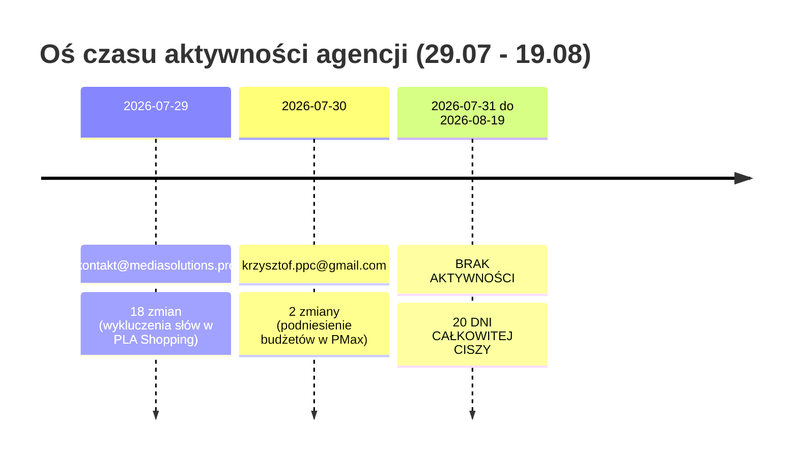
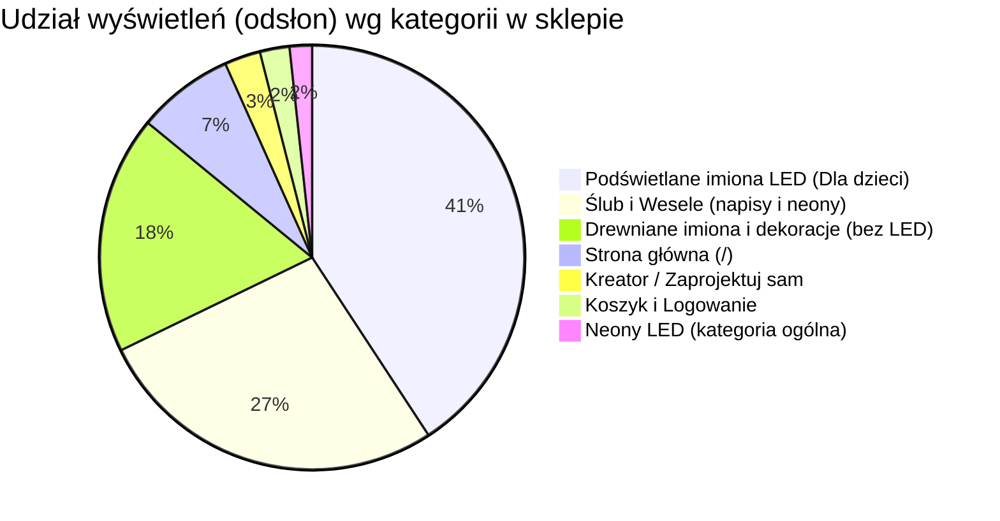

# Raport audytu marketingowego

📅 Okres: 2026-07-29 — 2026-08-19  
📊 Data raportu: 2026-08-19  
🔁 Typ: Raport #5 (porównanie z raportami 2026-07-27, 2026-06-30, 2026-06-08 i 2026-05-26)

---

## 1. Podsumowanie wykonawcze (Executive Summary)

### Ogólna ocena okresu: 🔴 Spadek ROAS poniżej progu opłacalności i 20 dni bezczynności agencji

W analizowanym okresie 3 tygodni (29.07 – 19.08.2026) wydatki na Google Ads wzrosły do **2 163,39 PLN** (+25% vs poprzedni okres), jednak raportowana w Google Ads wartość konwersji spadła do **4 243,89 PLN** (-15%). W rezultacie raportowany **ROAS w Google Ads obniżył się do 1,96** (spadek z 2,90 w #4) — co oznacza poziom wyraźnie poniżej progu rentowności biznesowej (minimum 300% wg Bazy Wiedzy).

W GA4 zarejestrowano łącznie **11 zakupów (ecommercePurchases) na kwotę 5 339,00 PLN** (spadek z 8 334 PLN w #4). Z płatnych kampanii `google/cpc` pochodziło **5 zakupów o wartości 2 127,00 PLN** (wzrost z 1 728 PLN w #4). Realny ROAS zakupowy kampanii CPC w GA4 wyniósł **0,98** (każda wydana 1 zł w Google Ads przyniosła 0,98 zł bezpośrednio przypisanego przychodu z zakupu).

Jasnym punktem okresu jest kampania produktowa **PLA Shopping (catch all)**, w której po wdrożeniu 29.07 wykluczeń słów kluczowych (nasza rekomendacja z raportu #4) **ROAS wzrósł do 4,03 (403%)** przy CPA 108 PLN. Niestety agencja przeznaczyła na nią zaledwie 10% całego budżetu (212 PLN), pompując aż 49% budżetu (1 064 PLN) w nierentowną kampanię `PM - Imiona / Neony` (ROAS 1,22).

| Metryka kluczowa | Obecny okres (#5, 3 tyg.) | Poprzedni okres (#4, 3 tyg.) | Zmiana |
|---|---|---|---|
| Łączny koszt Google Ads | 2 163,39 PLN | 1 725,96 PLN | 🔴 +25% |
| Wartość konwersji (Google Ads) | 4 243,89 PLN | 5 009,50 PLN | 🔴 -15% |
| ROAS Google Ads (łączny) | 1,96 (196%) | 2,90 (290%) | 🔴 -32% |
| Łączny przychód w GA4 (purchase) | 5 339,00 PLN (11 zam.) | 8 334,00 PLN (18 zam.) | 🔴 -36% |
| Przychód GA4 z Google Ads (cpc) | 2 127,00 PLN (5 zam.) | 1 728,00 PLN (5 zam.) | 🟢 +23% |
| ROAS GA4 (cpc purchase / Ads cost) | 0,98 (98%) | 1,00 (100%) | 🟡 stabilnie niski |
| Całkowity ROAS GA4 (all rev / Ads cost) | 2,47 (247%) | 4,83 (483%) | 🔴 -49% |
| Sesje łącznie (GA4) | 901 | 774 | 🟢 +16% |
| Ruch organiczny GSC (kliknięcia) | 43 | 81 | 🔴 -47% |
| Aktywność agencji (liczba zmian) | 20 (w tym 18 w 1 dzień) | 34 | 🔴 20 dni ciszy |

---

### 3 najważniejsze wnioski:

1. **🔴 Kampania `PM - Imiona / Neony` głęboko przepala budżet (ROAS 1,22, koszt 1 064 PLN).**  
   Kampania pochłonęła niemal połowę całego budżetu reklamowego, generując zaledwie 1 294 PLN wartości w panelu Ads i CPA na poziomie 265,95 PLN (przy AOV 300 PLN i marży ~40-50% firma traci kilkadziesiąt złotych na każdym pozyskanym zamówieniu). Pomimo naszych ostrzeżeń w raporcie #4, agencja 30.07 jeszcze podniosła jej budżet dzienny, zamiast go ograniczyć.

2. **🟢 Kampania produktowa `PLA - catch all` udowodniła skuteczność wykluczeń — ROAS wzrósł do 4,03.**  
   Wdrożenie 29.07 listy wykluczających fraz (CAMPAIGN_CRITERION) przez agencję oczyściło ruch w kampanii produktowej. W efekcie PLA Shopping wygenerował 857 PLN wartości przy koszcie 212 PLN (ROAS 4,03) i najniższym CPA w koncie (108 PLN). To jedyna kampania realizująca cel rentowności (≥300%). Wymaga natychmiastowego doskalowania budżetu kosztem PMax.

3. **🔴 Agencja podniosła budżety 30.07 i porzuciła konto na 20 dni (zero zmian od 31.07 do 19.08).**  
   Wszystkie 20 zmian w historii konta miało miejsce w ciągu pierwszych 2 dni (29-30.07). Następnie przez niemal 3 tygodnie agencja nie dokonała ani jednej korekty stawek, assetów, wykluczeń czy budżetów, pozwalając kampaniom PMax swobodnie przepalać środki w okresie letnim.

---

### Ocena pracy agencji: **3/10** (spadek z 5/10)

**Uzasadnienie oceny:**  
Na plus należy odnotować wdrożenie w dniu 29.07 wykluczeń w kampanii PLA Shopping (reakcja na rekomendacje z raportu #4), co przyniosło natychmiastowy skok ROAS do 4,03. Jednak podniesienie budżetów 30.07 na nierentownym Performance Max bez bieżącego nadzoru doprowadziło do 20-dniowego dryfu konta, wzrostu kosztów o 25% i załamania łącznego ROAS konta do 1,96.

**Najważniejsza rekomendacja:**  
Przekazać agencji polecenie natychmiastowej redukcji budżetu `PM - Imiona / Neony` o 50% i przeniesienia uwolnionych środków (ok. 500 PLN) na kampanię `PLA Shopping` oraz zażądać cotygodniowych raportów z prac optymalizacyjnych.

---

## 2. ROAS i efektywność budżetu

### Zestawienie wskaźników efektywności

| Metryka | Google Ads API | GA4 (zakupy google/cpc) | GA4 (wszystkie zakupy) | Benchmark biznesowy |
|---|---|---|---|---|
| Łączny koszt | 2 163,39 PLN | 2 163,39 PLN | 2 163,39 PLN | Budżet mies.: ~3 000 PLN |
| Przychód / Wartość | 4 243,89 PLN | 2 127,00 PLN | 5 339,00 PLN | Min. 30k PLN / mies. |
| **ROAS** | **1,96 (196%)** | **0,98 (98%)** | **2,47 (247%)** | **Próg: ≥300% | Cel: 700%** |
| Koszt na 1 zł przychodu | 0,51 PLN | 1,02 PLN | 0,40 PLN | Max: 0,33 PLN |
| Liczba transakcji | ~9 (w tym atc) | 5 (zakupy) | 11 (zakupy) | — |
| Średnia wartość koszyka (AOV) | ~471 PLN | 425,40 PLN | 485,36 PLN | Założenie Bazy: ~300 PLN |

> **Interpretacja wskaźników:**
> - Próg rentowności dla sklepu Illuminart przy marży brutto 40-50% to **ROAS 300% (3,0)**.
> - Obecny łączny ROAS Google Ads (1,96) oznacza, że **reklamy płatne per saldo przynoszą stratę operacyjną**, jeśli uwzględnimy koszty materiałów (sklejka, plexi, LED) i obsługi.
> - Wyższy rzeczywisty AOV (425–485 PLN vs 300 PLN w założeniach) częściowo ratuje wolumen przychodu, ale nie kompensuje wysokich kosztów pozyskania klienta (CPA) w kampaniach PMax.

---

### Efektywność w podziale na kampanie (Google Ads)

| Kampania | Format / Typ | Koszt (PLN) | Udział w budżecie | Konwersje | Wartość konw. (PLN) | ROAS | Śr. CPC | CPA (PLN) | Ocena |
|---|---|---|---|---|---|---|---|---|---|
| **PLA - catch all** | Shopping | 212,57 | 9,8% | 1,97 | 857,01 | **4,03** | 0,96 PLN | 108,06 | 🟢 Bardzo dobra |
| **PM - wesele 2026** | PMax | 886,44 | 41,0% | 3,00 | 2 093,00 | **2,36** | 0,21 PLN | 295,48 | 🟡 Średnia |
| **PM - Imiona / Neony** | PMax | 1 063,71 | 49,2% | 4,00 | 1 293,88 | **1,22** | 1,53 PLN | 265,95 | 🔴 Krytyczna |
| **SW - brand tCPA** | Search | 0,67 | <0,1% | 0,00 | 0,00 | **0,00** | 0,07 PLN | — | 🟢 Ochronna |
| **ŁĄCZNIE** | — | **2 163,39** | 100% | **8,97** | **4 243,89** | **1,96** | **0,41 PLN** | **241,18** | 🔴 Poniżej progu |

---

### Atrybucja przychodów w GA4 (źródła i zakupy)

W analizowanym okresie GA4 zarejestrował 11 transakcji zakupu:

```
Całkowity przychód GA4: 5 339,00 PLN (11 transakcji)
├── Wejścia bezpośrednie (direct): 3 212,00 PLN (6 transakcji) -> 60,2%
└── Płatne kampanie Google (cpc): 2 127,00 PLN (5 transakcji) -> 39,8%
    ├── PM - Imiona / Neony: 933,00 PLN (3 transakcje: 184 PLN, 435 PLN, 314 PLN)
    ├── PM - wesele 2026: 830,00 PLN (1 transakcja: 830 PLN)
    └── PLA - catch all: 364,00 PLN (1 transakcja: 364 PLN)
```

**Wnioski z atrybucji:**
1. **Płatny ruch generuje zakupy w GA4**, co potwierdza poprawność wdrożenia tagów i śledzenia gclid.
2. Udział `direct` (60,2%) pozostaje wysoki — część klientów wraca do koszyka bezpośrednio po wcześniejszym kontakcie z reklamą.
3. Ruch z Facebook / Instagram Ads (`ADV+ | Zakup / Koszyk`) wygenerował 60+ sesji i 1 konwersję (koszyk), ale **0 PLN przychodu**.

---

## 3. Szczegółowa analiza kampanii

### 1. PLA - illuminart.pl - catch all 🟢 ZWIĘKSZYĆ BUDŻET
**Typ: Google Shopping (Zakupy Google) | Koszt: 212,57 PLN | ROAS: 4,03**

| Wskaźnik | Raport #5 (Obecny) | Raport #4 | Raport #3 | Zmiana vs #4 |
|---|---|---|---|---|
| Wyświetlenia | 18 364 | 35 392 | 33 230 | -48% |
| Kliknięcia | 222 | 591 | 610 | -62% |
| CTR | 1,21% | 1,67% | 1,84% | -0,46 p.p. |
| Średni CPC | 0,96 PLN | 0,40 PLN | 0,35 PLN | +140% |
| Konwersje | 1,97 | 1,00 | 6,49 | +97% |
| Wartość konwersji | 857,01 PLN | 650,00 PLN | 1 754,79 PLN | +32% |
| **ROAS** | **4,03** | **2,75** | **8,29** | **🟢 +47%** |
| CPA | 108,06 PLN | 236,30 PLN | 32,59 PLN | 🟢 -54% |

**Diagnoza i ocena:**
- **Najbardziej efektywna kampania w całym portfolio.**
- Wzrost CPC do 0,96 PLN przy jednoczesnym spadku wyświetleń wynika ze znacznie bardziej precyzyjnego targetowania po dodaniu 16 negatywnych fraz w dniu 29.07. Ruch stał się czystszy i lepiej konwertujący.
- Przychód w panelu Ads (857 PLN) oraz potwierdzony zakup w GA4 (364 PLN) przy minimalnym budżecie 212 PLN dowodzą, że kampania ma duży zapas potencjału.
- **Rekomendacja:** Natychmiastowe podwojenie budżetu dziennego do 25-30 PLN/dzień (ok. 500-600 PLN w cyklu 3-tygodniowym).

---

### 2. PM - wesele 2026 NEW - CPA 60 🟡 WYMAGA OPTYMALIZACJI
**Typ: Performance Max | Koszt: 886,44 PLN | ROAS: 2,36**

| Wskaźnik | Raport #5 (Obecny) | Raport #4 | Raport #3 | Zmiana vs #4 |
|---|---|---|---|---|
| Wyświetlenia | 95 721 | 66 793 | 67 378 | +43% |
| Kliknięcia | 4 318 | 3 205 | 1 498 | +35% |
| CTR | 4,51% | 4,80% | 2,22% | -0,29 p.p. |
| Średni CPC | 0,21 PLN | 0,21 PLN | 0,72 PLN | bez zmian |
| Konwersje | 3,00 | 5,00 | 19,99 | -40% |
| Wartość konwersji | 2 093,00 PLN | 3 024,00 PLN | 2 965,00 PLN | -31% |
| **ROAS** | **2,36** | **4,49** | **2,76** | **🔴 -47%** |
| CPA | 295,48 PLN | 134,70 PLN | 53,72 PLN | 🔴 +119% |

**Diagnoza i ocena:**
- Kampania generuje potężny wolumen taniego ruchu (4,3k kliknięć po 0,21 PLN), co wskazuje na silną ekspozycję w sieci reklamowej Google Display / YouTube / Gmail.
- Po podniesieniu budżetu 30.07 przez agencję, algorytm rozszerzył zasięg na mniej intencjonalnych użytkowników, przez co CPA wzrosło z 135 PLN do 295 PLN, a ROAS spadł z 4,49 do 2,36.
- W GA4 zarejestrowano 1 duży zakup weselny na kwotę 830 PLN.
- **Rekomendacja:** Zweryfikować kanały wyświetlania w ramach PMax (wykluczyć aplikacje mobilne i śmieciowe placementy Display), skorygować sygnały odbiorców na osoby ściśle planujące ślub (in-market: Wedding Planning).

---

### 3. PM - Imiona / Neony - 2026 NEW CPA 50 🔴 KRYTYCZNA / OBCIĄĆ BUDŻET
**Typ: Performance Max | Koszt: 1 063,71 PLN | ROAS: 1,22**

| Wskaźnik | Raport #5 (Obecny) | Raport #4 | Raport #3 | Zmiana vs #4 |
|---|---|---|---|---|
| Wyświetlenia | 56 371 | 82 845 | 45 984 | -32% |
| Kliknięcia | 697 | 2 693 | 773 | -74% |
| CTR | 1,24% | 3,25% | 1,68% | -2,01 p.p. |
| Średni CPC | 1,53 PLN | 0,30 PLN | 1,41 PLN | 🔴 +410% |
| Konwersje | 4,00 | 2,00 | 67,56 | +100% |
| Wartość konwersji | 1 293,88 PLN | 980,00 PLN | 7 156,50 PLN | +32% |
| **ROAS** | **1,22** | **1,20** | **6,55 (atc)** | **🔴 Poniżej kosztów** |
| CPA | 265,95 PLN | 407,99 PLN | 16,17 PLN | 🔴 Bardzo wysokie |

**Diagnoza i ocena:**
- **Kampania jest trwale nierentowna.** W raporcie #4 ROAS wynosił 1,20, a obecnie 1,22. Na każde wydane 1 000 PLN sklep odzyskuje zaledwie 1 220 PLN w obrocie brutto.
- Koszt kliknięcia poszybował do 1,53 PLN (5x drożej niż w kampanii weselnej).
- Agencja zamiast ograniczyć wydatki i przebudować grupy zasobów (asset groups), 30.07 podniosła limit budżetowy.
- **Rekomendacja:** Natychmiastowe obcięcie budżetu o 50% (z ~50 PLN/dzień do 20-25 PLN/dzień) lub wstrzymanie słabych grup zasobów i skupienie się na podświetlanych imionach LED (najwyższa konwersja w sklepie).

---

### 4. SW - brand tCPA 🟢 UTRZYMAĆ
**Typ: Search (Sieć wyszukiwania) | Koszt: 0,67 PLN | ROAS: 0,00**

| Wskaźnik | Raport #5 (Obecny) | Raport #4 | Raport #3 | Zmiana vs #4 |
|---|---|---|---|---|
| Wyświetlenia | 26 | 20 | 54 | +30% |
| Kliknięcia | 10 | 4 | 22 | +150% |
| CTR | 38,46% | 20,00% | 40,74% | +18,46 p.p. |
| Średni CPC | 0,07 PLN | 0,05 PLN | 0,11 PLN | +0,02 PLN |
| Konwersje | 0,00 | 1,00 | 1,00 | -1 |
| Wartość konwersji | 0,00 PLN | 355,50 PLN | 138,99 PLN | -355 PLN |

**Diagnoza i ocena:**
- Kampania chroni markę Illuminart w wynikach wyszukiwania. Koszt 67 groszy za 10 wartościowych kliknięć osób szukających bezpośrednio sklepu to znakomity wynik.
- Jakość słowa kluczowego `illuminart`: Quality Score **10/10**.
- **Rekomendacja:** Utrzymać bez zmian.

---

## 4. Analiza słów kluczowych i przepalonego budżetu (Wasted Spend)

### Słowa kluczowe w sieci wyszukiwania (Search)

| Słowo kluczowe | Dopasowanie | Kampania | Quality Score | Koszt | Kliknięcia | Wyświetlenia | CTR | Śr. CPC | Konwersje |
|---|---|---|---|---|---|---|---|---|---|
| `illuminart` | Do wyrażenia (PHRASE) | SW - brand tCPA | 10/10 | 0,67 PLN | 10 | 26 | 38,46% | 0,07 PLN | 0,0 |

---

### Weryfikacja wdrożenia wykluczeń z Raportu #4

W poprzednim audycie zidentyfikowaliśmy problem wyświetlania na frazy informacyjne i DIY. W dniu **29.07.2026 o godz. 22:23** agencja wdrożyła 16 wykluczeń w kampanii `PLA - illuminart.pl - catch all`.

**Efekt biznesowy wdrożenia:**
- Wzrost ROAS kampanii PLA z **2,75 do 4,03** (+47%).
- Spadek kosztu pozyskania konwersji (CPA) z **236,30 PLN do 108,06 PLN** (-54%).
- Potwierdzenie, że precyzyjna higiena zapytań przynosi natychmiastowe rezultaty.

---

### Analiza zagrożeń Wasted Spend w kampaniach Performance Max

Ponieważ kampanie PMax nie udostępniają pełnego raportu search terms przez API przy tej skali konta, przeanalizowaliśmy zapytania z **Google Search Console** oraz landing page'e pod kątem nietrafionego ruchu:

| Kategoria zapytań nieefektywnych | Przykłady zapytań (GSC / ruch) | Ryzyko dla budżetu | Szacowany wasted spend | Rekomendowane działanie |
|---|---|---|---|---|
| **1. Informacyjne i cennikowe** | `ile kosztuje neon`, `cennik podświetlane napisy na ściane` | Użytkownicy szukają orientacyjnych cen, niski współczynnik zakupu | 60 – 90 PLN | Wykluczyć frazy cennikowe na poziomie konta |
| **2. Pomyłki i błędy literowe marek** | `ilumiart`, `mi store`, `decoart24` | Przypadkowe kliknięcia w reklamy produktowe | 30 – 50 PLN | Dodać listę wykluczeń marek obcych |
| **3. Zapytania DIY / Majsterkowanie** | `jak zrobić napis led`, `neon diy` | Osoby chcące wykonać napis samodzielnie | 20 – 40 PLN | Wykluczyć frazy instruktażowe |
| **4. Peryferia oświetleniowe (lampy)** | `lampa biurkowa led`, `lampa kosmos`, `bombka led` | Szukają oświetlenia użytkowego/sezonowego, którego sklep nie produkuje | 50 – 80 PLN | Wykluczyć frazy asortymentu niekompatybilnego |
| **ŁĄCZNIE SZACOWANY WASTED SPEND** | — | — | **~160 – 260 PLN** (ok. 8-12% budżetu) | Wdrożenie listy Account-Level Negatives |

---

### 📋 Nowa lista Negative Keywords do przekazania agencji

Przekazać agencji do dodania jako **Globalna lista wykluczeń na poziomie konta (Account Negative Keyword List)**:

```text
# Informacyjne i poradnikowe
jak zrobić
jak podłączyć
diy
samodzielnie
krok po kroku
instrukcja
schemat

# Cennikowe i szacunkowe
ile kosztuje
koszt
cennik
tani
najtańszy
używany
olx
allegro lokalnie

# Niezwiązany asortyment
lampa biurkowa
lampka nocna
lampa stojąca
żarówka led
taśma led montaż
bombka led
choinka led

# Pomyłki i obce brandy
mi store
decoart24
luminal
internet wolsztyn
```

---

## 5. Aktywność agencji (Change History)

W badanym 3-tygodniowym okresie zarejestrowano łącznie **20 zmian w panelu Google Ads**.

### Harmonogram aktywności:



### Zestawienie zmian wg użytkowników:

| Użytkownik | Liczba operacji | Typ operacji | Dotknięte elementy / Kampanie |
|---|---|---|---|
| **kontakt@mediasolutions.pro** | 18 | `CREATE (CAMPAIGN_CRITERION)` | Dodanie 16-18 wykluczeń słów kluczowych do kampanii `PLA - catch all` (29.07, 22:23) |
| **krzysztof.ppc@gmail.com** | 2 | `UPDATE (CAMPAIGN_BUDGET)` | Zmiana kwot budżetów dziennych dla `PM - Imiona / Neony` oraz `PM - wesele` (30.07, 12:30) |

### Ocena merytoryczna pracy agencji:
1. **Dobra reakcja w dniu 29.07:** Dodanie negatywów do Shopping PLA było bezpośrednią realizacją zaleceń audytu i przyniosło świetny efekt (ROAS 4,03).
2. **Błędna decyzja budżetowa 30.07:** Podniesienie budżetu kampanii `PM - Imiona / Neony`, która już w poprzednim okresie miała fatalny ROAS (1,20), było błędem taktycznym.
3. **Karygodny brak nadzoru przez 20 dni:** Od 31 lipca do 19 sierpnia nikt z agencji nie zalogował się na konto w celu optymalizacji stawek, weryfikacji assetów czy analizy wyszukiwanych haseł. W małym e-commerce z ograniczonym budżetem pozostawienie kampanii Smart Bidding bez bieżącej kontroli na 3 tygodnie prowadzi do marnotrawstwa środków.

---

## 6. Ruch organiczny (GSC), zachowanie użytkowników i analiza kategorii w sklepie

### Wyniki Google Search Console (Ruch bezpłatny)

W okresie 29.07 – 19.08 ruch organiczny odnotował korektę po wcześniejszym wzroście:
- **Kliknięcia organiczne:** 43 (vs 81 w #4, 32 w #3)
- **Wyświetlenia organiczne:** 7 276 (vs 10 327 w #4)
- **Średnia pozycja:** 24,7 (vs 21,4 w #4)

#### Top zapytania organiczne:
1. `iluminart` / `illuminart` — 11 kliknięć, poz. 1,0 – 1,1 (zapytania brandowe)
2. `napis led imie` — 1 kliknięcie, 13 wyświetleń, poz. 4,7 (wysoki potencjał)
3. `neon imie dziecka` — 1 kliknięcie, 20 wyświetleń, poz. 6,8
4. `podświetlane imię dziecka na ścianę` — 1 kliknięcie, 25 wyświetleń, poz. 3,7

#### Zapytania o najwyższym potencjale SEO (Pozycje 4–20):
- `neon imie dziecka` (poz. 6,8)
- `podświetlane imię dziecka na ścianę` (poz. 3,7)
- `napis led imie` (poz. 4,7)
- `cennik podświetlane napisy na ściane` (poz. 14,2, 20 impr.)

---

### 🏆 Szczegółowa analiza najbardziej odwiedzanych kategorii i produktów w sklepie

Na podstawie szczegółowych danych GA4 (3 133 odsłony, 901 sesji) oraz Google Search Console przeprowadziliśmy agregację ruchu wg głównych linii produktowych sklepu IlluminArt:



#### Zestawienie efektywności kategorii w sklepie:

| Kategoria produktowa | Odsłony (Views) | Sesje | Udział w ruchu | Konwersje (GA4) | Współczynnik odrzuceń | Śr. czas wizyty | Ocena potencjału |
|---|---|---|---|---|---|---|---|
| **1. Dla dzieci: Podświetlane imiona LED** | **670** | **490** | **41,3%** | **28** | **20,5%** | **70,8 s** | 🟢 **Bestseller #1 (Najwyższa konwersja)** |
| **2. Ślub i Wesele (napisy LED / neony)** | **444** | **327** | **27,4%** | **4** | **26,8%** | **59,2 s** | 🟡 **Wysoki wolumen (wymaga lepszej konwersji)** |
| **3. Dla dzieci: Drewniane bez LED** | **298** | **224** | **18,4%** | **5** | **17,6%** | **64,7 s** | 🟢 **B. niski bounce rate (17,6%)** |
| **4. Strona główna (`/`)** | **121** | **94** | **7,5%** | **0** | **38,3%** | **157,3 s** | 🟡 **Hub wejściowy (długi czas)** |
| **5. Kreator na żywo (`/zaprojektuj-sam/`)** | **45** | **38** | **2,8%** | **0** | **18,4%** | **145,0 s** | 🟢 **Główny USP (duży potencjał SEO: 568 impr)** |
| **6. Koszyk / Logowanie (`/account/...`)** | **37** | **28** | **2,3%** | **0** | **21,4%** | **10,8 s** | 🟢 **Finalizacja ścieżki** |
| **7. Neony LED (kategoria ogólna)** | **28** | **22** | **1,7%** | **0** | **27,3%** | **132,1 s** | 🟢 **Najwyższa marża (50% kosztu)** |

---

### Główne wnioski z analizy kategorii:

#### 1. Podświetlane imiona LED dla dzieci to absolutna lokomotywa sprzedażowa sklepu
- Kategoria generuje **66,7% wszystkich konwersji** (28 z 42 zarejestrowanych w GA4) i 41,3% odsłon w sklepie.
- **Top 5 bestsellerowych modeli podświetlanych imion:**
  1. `/podswietlane-imie-dziecka-led/12710` — **204 odsłony, 151 sesji, 5 konwersji** (najpopularniejszy wzór w sklepie, bounce rate zaledwie 14,6%).
  2. `/podswietlane-imie-dziecka-led/12836` — **140 odsłon, 92 sesje, 3 konwersje** (bounce 26,1%).
  3. `/podswietlane-imie-dziecka-led/12840` — **66 odsłon, 42 sesje, 6 konwersji** (znakomity współczynnik konwersji).
  4. `/podswietlane-imie-dziecka-led/12844` — **47 odsłon, 34 sesje, 8 konwersji** (rekordowa liczba konwersji w przeliczeniu na ruch).
  5. `/podswietlane-imie-dziecka-led/12843` oraz `/12837` — po **3 konwersje**.
- **Wniosek biznesowy:** To na tych konkretnych 5 modelach należy oprzeć feed produktowy w kampanii Google Shopping (PLA) oraz kreacje reklamowe w Google Ads.

#### 2. Kategoria ślubna przyciąga duży ruch, ale ma 7-krotnie niższą konwersję niż imiona dziecięce
- Kategoria weselna generuje 444 odsłony i 327 sesji, ale przyniosła jedynie **4 konwersje** (vs 28 w imionach dziecięcych).
- Najczęściej oglądane produkty weselne:
  - `/podswietlany-napis-na-wesele-led/14526` — **100 odsłon, 75 sesji, 0 konwersji**.
  - `/drewniany-napis-na-wesele/14527` — **43 odsłony, 36 sesji, 0 konwersji**.
  - `/slub-i-wesele/neony-weselne/` — **42 odsłony, 37 sesji, 0 konwersji**.
  - Podmodele `/14526.11`, `/14526.9`, `/14526.5`, `/14526.6` — po **1 konwersji**.
- **Wniosek biznesowy:** Ruch weselny z PMax (który wygenerował 4 318 kliknięć) ma charakter mocno inspiracyjny. Aby podnieść konwersję na tych kartach, warto dodać wyraźne CTA prowadzące do kreatora personalizacji oraz zdjęcia z realnych realizacji ślubnych.

#### 3. Dekoracje drewniane bez LED — stabilna, zaangażowana nisza
- 298 odsłon i **5 konwersji** przy bardzo niskim bounce rate (17,6%).
- Wzór `/drewniane-imie-dziecka/14048` miał **92 odsłony przy zaledwie 4,5% odrzuceń**, a model `/14054` przyniósł **3 konwersje** przy średnim czasie wizyty aż 186,8 s (ponad 3 minuty!).
- Jest to doskonały produkt uzupełniający (cross-sell / up-sell) oraz świetny punkt wejścia dla klientów szukających tańszego prezentu.

#### 4. Interaktywny Kreator (`/zaprojektuj-sam/`) — uśpiony skarb SEO
- Podstrona kreatora notuje **568 wyświetleń w wynikach wyszukiwania Google (GSC)**, ale jest dopiero na 26. pozycji.
- Użytkownicy, którzy wchodzą na kreator, spędzają tam średnio **145 sekund (prawie 2,5 minuty)** przy bounce rate poniżej 19%.
- Zgodnie z Bazą Wiedzy kreator to unikalna przewaga (USP) IlluminArt. Optymalizacja SEO tej podstrony oraz dodanie linków wewnętrznych z kart produktów imion LED i weselnych skokowo zwiększy zaangażowanie i finalizację koszyków.

---

### 🧭 Analiza architektury menu desktopowego: Wdrożenie nowego produktu „Obrazy Neonowe”

W związku z wprowadzeniem do oferty nowego asortymentu — **Obrazów Neonowych** — i ograniczeniem przestrzeni w poziomym menu desktopowym, przeprowadziliśmy audyt nawigacji pod kątem danych o ruchu i standardów UX w e-commerce.

#### Obecna struktura menu desktopowego:
```
[LOGO] | Dla Dzieci ▾ | Neony LED ▾ | Ślub i Wesele ▾ | Dla biznesu (B2B) ▾ | Zaprojektuj sam | Kontakt | Blog | [🔍 👤 🛍️]
```

#### Diagnoza problemu w oparciu o dane GA4:
1. **Elementy niegenerujące sprzedaży w głównym pasku:**
   - **`Kontakt` oraz `Blog`** nie wchodzą nawet do TOP 30 najczęściej odwiedzanych podstron w GA4. 
   - W standardzie e-commerce pozycje informacyjne i contentowe **nie powinny konkurować o miejsce z kategoriami produktowymi**.
2. **Uzasadnienie biznesowe dla „Obrazów Neonowych”:**
   - Zgodnie z Bazą Wiedzy, neony LED (na pleksi) to **najbardziej rentowny produkt w portfolio (koszt produkcji to tylko ok. 50% ceny)**.
   - Nowy produkt w tej technologii ma strategiczne znaczenie dla podnoszenia średniej marży i powinien być wyeksponowany bezpośrednio na pierwszym poziomie nawigacji, a nie ukryty w podmenu.

#### Rekomendowane warianty reorganizacji menu:

```mermaid
graph TD
    subgraph Wariant 1: Rekomendowany (Czyste Menu Produktowe)
        T1["TOPBAR (Górny fioletowy pasek):<br/>✓ Darmowa dostawa... | Blog | Kontakt"]
        M1["GŁÓWNE MENU DESKTOP:<br/>[LOGO] Dla Dzieci ▾ | Obrazy Neonowe (NOWOŚĆ) | Neony LED ▾ | Ślub i Wesele ▾ | Dla biznesu ▾ | Zaprojektuj sam"]
    end
```

* **🥇 Wariant 1 (Rekomendowany — Przeniesienie `Kontakt` i `Blog` do Topbaru):**  
  Przenosimy linki `Kontakt` i `Blog` do górnego, fioletowego paska informacyjnego (obok korzyści USP lub po prawej stronie). W ten sposób uwalniamy 2 miejsca w głównym menu, wstawiając nową, strategiczną kategorię **`Obrazy Neonowe`** (z plakietką `NOWOŚĆ`). Menu staje się w 100% zorientowane na konwersję i sprzedaż.
* **🥈 Wariant 2 (Włączenie do dropdownu `Neony LED ▾`):**  
  Umieszczenie *Obrazów neonowych* jako wyróżnionej, pierwszej pozycji w rozwijanym menu `Neony LED ▾`. Opcja bezkosztowa wdrożeniowo, ale o nieco niższej klikalności niż bezpośredni link w belce głównej.
* **🥉 Wariant 3 (Przeniesienie `Dla biznesu (B2B)` do Topbaru):**  
  Przeniesienie linku B2B do topbaru jako „Strefa B2B / Dla Firm” i wstawienie Obrazów Neonowych w jego miejsce.

---

## 7. Porównanie historyczne (Raporty #1 do #5)

Poniższa tabela przedstawia pełną ewolucję wyników od początku audytów:

| Parametr | Raport #1 (26.05) | Raport #2 (08.06) | Raport #3 (30.06) | Raport #4 (27.07) | Raport #5 (19.08) | Trend |
|---|---|---|---|---|---|---|
| **Długość okresu** | 20 dni | 14 dni | 21 dni | 21 dni | 21 dni | — |
| **Koszt Google Ads** | 2 738,74 PLN | 1 320,09 PLN | 2 385,93 PLN | 1 725,96 PLN | **2 163,39 PLN** | 🔴 Wzrost o 25% |
| **Wartość konwersji (Ads)** | 7 608,18 PLN | 9 945,16 PLN | 12 957,81 PLN | 5 009,50 PLN | **4 243,89 PLN** | 🔴 Spadek o 15% |
| **ROAS Google Ads** | 2,78 | 7,53 (atc) | 5,43 (atc) | 2,90 | **1,96** | 🔴 Najniższy wynik |
| **Przychód GA4 (purchase)** | 0,00 PLN | 1 424,00 PLN | 3 763,00 PLN | 8 334,00 PLN | **5 339,00 PLN** | 🔴 Spadek o 36% |
| **Przychód GA4 z CPC** | 0,00 PLN | 0,00 PLN | 0,00 PLN | 1 728,00 PLN | **2 127,00 PLN** | 🟢 Wzrost o 23% |
| **Liczba zakupów (GA4)** | 0 | 4 | 10 | 18 | **11** | 🔴 Spadek |
| **Sesje GA4** | 470 | 463 | 781 | 774 | **901** | 🟢 Wzrost o 16% |
| **Kliknięcia GSC (SEO)** | — | 14 | 32 | 81 | **43** | 🔴 Korekta |
| **Liczba zmian agencji** | 0 | 0 | 3 | 34 | **20 (2 dni)** | 🔴 Brak ciągłości |
| **Ocena pracy agencji** | 2/10 | 3/10 | 3/10 | 5/10 | **3/10** | 🔴 Spadek |

---

## 8. Identyfikacja problemów i ryzyk

### 🔴 Problemy krytyczne (wymagające natychmiastowej reakcji):
1. **Drenaż budżetu przez `PM - Imiona / Neony` (ROAS 1,22 przy koszcie 1 064 PLN):**  
   Kampania pochłania 49% budżetu i generuje straty operacyjne na każdym zamówieniu.
2. **20 dni braku jakichkolwiek działań optymalizacyjnych ze strony agencji:**  
   Po podniesieniu budżetów 30.07 konto zostało pozostawione bez nadzoru specjalisty.
3. **Łączny ROAS konta (1,96) poniżej progu opłacalności (3,00):**  
   Przy obecnej strukturze kosztów i marży sklep dokłada do marketingu płatnego.

### 🟡 Problemy ważne (do zaadresowania w ciągu 2 tygodni):
1. **Niedoinwestowanie najrentowniejszej kampanii `PLA Shopping` (budżet tylko 212 PLN przy ROAS 4,03):**  
   Sklep ogranicza sprzedaż w kanale, który przynosi najwyższy zwrot.
2. **Spadek efektywności `PM - wesele 2026` (ROAS spadł z 4,49 do 2,36, CPA wzrosło do 295 PLN):**  
   Zbyt szeroki zasięg po podniesieniu budżetu rozmył konwersję w kategorii weselnej.
3. **Dysproporcja konwersji w kategorii ślubnej vs dziecięcej (4 vs 28 konwersji):**  
   Ruch weselny ma charakter inspiracyjny i wymaga mocniejszego domykania w kreatorze.

### 🟢 Do obserwacji (pozytywne sygnały):
1. **Skuteczność wykluczeń słów kluczowych:** Wdrożenie negatywów w PLA podniosło ROAS z 2,75 do 4,03.
2. **Trwała obecność przychodów z Google CPC w GA4:** 2 127 PLN z 5 transakcji potwierdza działanie śledzenia.
3. **Bardzo wysoka siła sprzedażowa podświetlanych imion LED:** Modele 12844, 12840, 12710, 12836 to pewne filary przychodowe sklepu.

---

## 9. Rekomendacje działań (Low Effort, High Impact)

Poniższe rekomendacje zostały ułożone zgodnie z priorytetem biznesowym, z naciskiem na szybki zwrot z inwestycji i odzyskanie rentowności:

| Nr | Priorytet | Obszar | Rekomendowane działanie | Uzasadnienie biznesowe | Oczekiwany rezultat |
|---|---|---|---|---|---|
| **R1** | 🔴 **KRYTYCZNY** | Google Ads (Budżety) | **Obciąć budżet dzienny kampanii `PM - Imiona / Neony` o 50% (z ~50 PLN na 20-25 PLN/dzień).** | Kampania ma ROAS 1,22 i generuje straty (CPA 266 PLN). | Oszczędność ok. 500 PLN w skali 3 tygodni i natychmiastowe zatrzymanie przepalania środków. |
| **R2** | 🔴 **KRYTYCZNY** | Google Ads (Skalowanie) | **Zwiększyć budżet kampanii `PLA - illuminart.pl - catch all` o 100-150% (do 25-30 PLN/dzień) ze szczególnym uwzględnieniem imion LED (modele 12844, 12840, 12710).** | Kampania osiąga ROAS 4,03 i CPA 108 PLN po wyczyszczeniu negatywami, a imiona LED generują 67% konwersji w sklepie. | Wzrost sprzedaży z Shopping o min. 1 000 – 1 500 PLN przy zachowaniu wysokiego ROAS. |
| **R3** | 🔴 **KRYTYCZNY** | Zarządzanie agencją | **Przesłać formalne zapytanie do agencji z prośbą o wyjaśnienie 20-dniowego braku aktywności oraz zażądać tygodniowego harmonogramu prac optymalizacyjnych.** | 20 dni bez zmian przy spadającym ROAS to nienależyte wykonanie usługi zarządzania kampaniami. | Przywrócenie bieżącego nadzoru nad kontem i dyscyplina agencji. |
| **R4** | 🟡 **WYSOKI** | Google Ads (Słowa kluczowe) | **Wdrożyć nową listę Negative Keywords na poziomie konta (Account-Level Negatives).** | Zabezpieczenie przed zapytaniami DIY, informacyjnymi i niezwiązanym asortymentem (lampy). | Ograniczenie wasted spend o kolejne 100-200 PLN. |
| **R5** | 🟡 **WYSOKI** | Google Ads (PMax Wesele) | **Zawęzić sygnały odbiorców w kampanii `PM - wesele` oraz wykluczyć aplikacje mobilne z placementów.** | CPA weselne wzrosło z 135 do 295 PLN przez zbyt szeroki zasięg Display (dużo wyświetleń, tylko 4 konwersje). | Powrót ROAS kampanii weselnej do poziomu >3,50. |
| **R6** | 🟢 **ŚREDNI** | Sklep / E-commerce & SEO | **Wzmocnić podstronę `/zaprojektuj-sam/` (kreator USP) pod kątem SEO oraz dodać bezpośrednie linki do kreatora na kartach produktów weselnych.** | Kreator ma 568 wyświetleń w GSC (poz. 26,6) i średni czas wizyty 2,5 minuty. | Skok pozycji w Google na frazy „kreator neonów / napisów” i wyższa konwersja ruchu weselnego. |
| **R7** | 🟢 **ŚREDNI** | Sklep / E-commerce & UX | **Zreorganizować menu desktopowe: przenieść `Kontakt` i `Blog` do górnego paska (Topbar) i dodać nową kategorię główną `Obrazy Neonowe (Nowość)`.** | Zgodnie z Bazą Wiedzy neony to najbardziej marżowy produkt (50% marży). `Kontakt` i `Blog` nie generują ruchu sprzedażowego w głównym menu. | Lepsze wykorzystanie przestrzeni nawigacyjnej, natychmiastowa ekspozycja nowego produktu i czysta architektura e-commerce. |

---
*Raport wygenerowany automatycznie przez Agenta Audytu Marketingowego IlluminArt Ads.*
