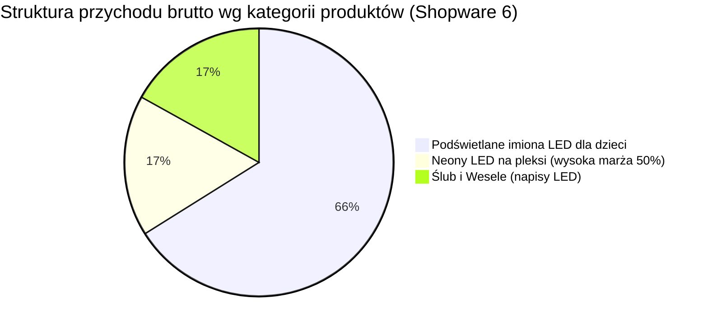
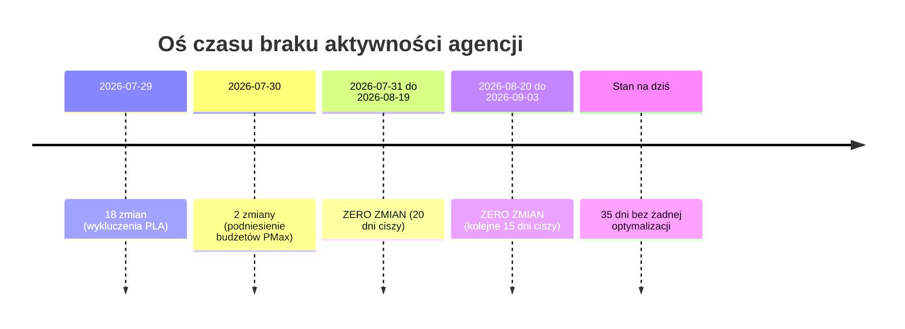
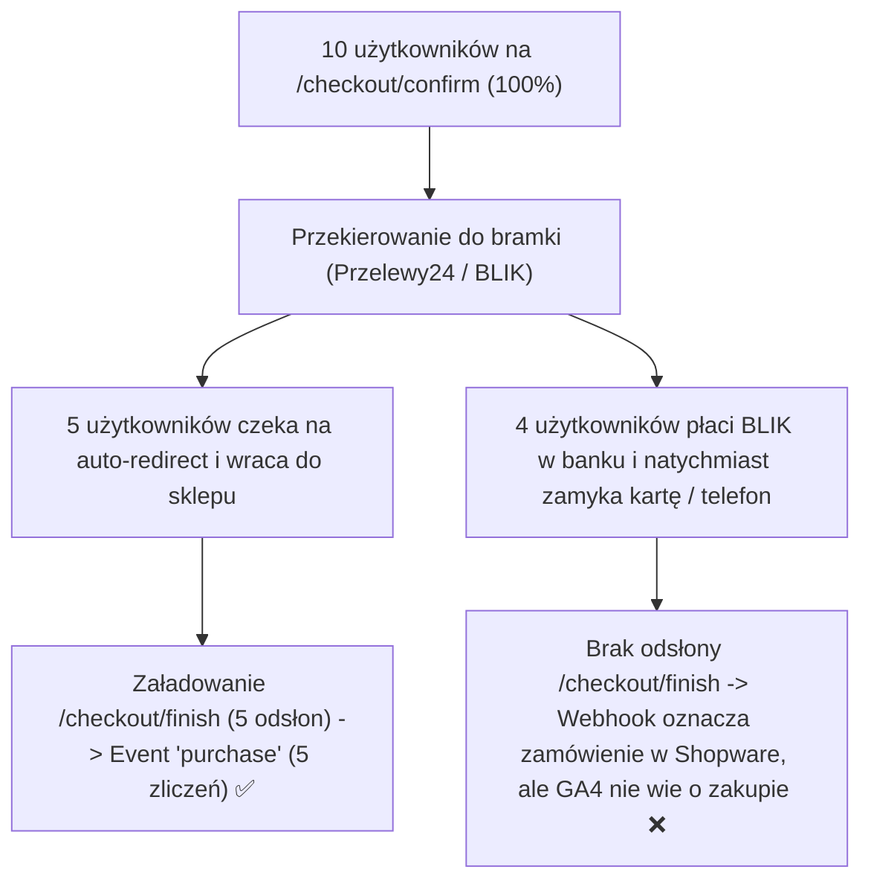

# Raport audytu marketingowego

📅 Okres: 2026-08-20 — 2026-09-03  
📊 Data raportu: 2026-09-03  
🔁 Typ: Raport #6 (porównanie z raportami 2026-08-19, 2026-07-27, 2026-06-30, 2026-06-08 i 2026-05-26)  
🔌 Źródła danych: **Google Ads API + GA4 API + Google Search Console API + Shopware 6 Admin API (Automatyczna integracja)**

---

## 1. Podsumowanie wykonawcze (Executive Summary)

### Ogólna ocena okresu: 🔴 Spadek rentowności poniżej progu opłacalności (ROAS sklepu 2,83) i 35 dni całkowitej bezczynności agencji

W badanym okresie 2 tygodni (20.08 – 03.09.2026) sklep zrealizował w systemie Shopware 6 **9 ważnych zamówień na kwotę 3 816,00 PLN brutto** (1 zamówienie zostało anulowane, AOV = 424,00 PLN). 

Przy wydatkach na Google Ads rzędu **1 347,26 PLN**, **rzeczywisty ROAS sklepu wyniósł 2,83 (283%)**. Oznacza to, że po raz pierwszy od trzech miesięcy wskaźnik efektywności spadł **poniżej minimalnego progu opłacalności (minimum 300% wg Bazy Wiedzy)**. Każda wydana 1 zł w reklamach wygenerowała 2,83 zł obrotu (koszt pozyskania obrotu: 0,35 zł na 1 zł przychodu). Przy kosztach produkcji sięgających 50-60% ceny, obecny poziom oznacza brak rentowności operacyjnej.

Główne przyczyny pogorszenia wyników:
1. **35 dni całkowitego porzucenia konta przez agencję:** W historii zmian Google Ads odnotowano **0 zmian w badanym okresie**. W połączeniu z 20 dniami bezczynności z poprzedniego okresu oznacza to, że od 30 lipca (przez 5 tygodni) agencja nie wprowadziła ani jednej optymalizacji, ani nie zareagowała na rekomendacje audytu.
2. **Katastrofalny wyciek budżetu w kampanii `PM - wesele`:** Kampania pochłonęła **531,94 PLN** (39,5% budżetu), wygenerowała **3 475 kliknięć** przy średnim CPC 0,15 PLN i przyniosła **0 konwersji w Google Ads**. Charakterystyka ruchu (nienaturalnie wysoki CTR 7,34%, ultra tani CPC) wskazuje na ruch śmieciowy z placementów w aplikacjach mobilnych i grach, którego agencja nie wykluczyła.
3. **Zapaść raportowanego ROAS w Google Ads (0,50):** Panel Google Ads zarejestrował zaledwie 2 konwersje na kwotę 674,00 PLN przy koszcie 1 347,26 PLN, wykazując oficjalną stratę.
4. **Wstrzymanie kampanii Brand (`SW - brand tCPA`):** Kampania ochrony marki ma obecnie status PAUSED, co pozbawiło sklep taniego zabezpieczenia zapytań brandowych.
5. **Niezmienna siła Bestsellera (Imiona LED dla dzieci):** Popyt organiczno-produktowy ratuje sprzedaż – 7 z 9 zamówień (66% obrotu) stanowiły podświetlane imiona LED dla dzieci.

| Metryka kluczowa | Obecny okres (#6, 14 dni) | Poprzedni okres (#5, 21 dni) | Zmiana |
|---|---|---|---|
| Łączny koszt Google Ads | 1 347,26 PLN | 2 163,39 PLN | 🟢 -38% (krótszy okres) |
| Przychód ze sklepu (Shopware 6 API) | 3 816,00 PLN (9 zam.) | 7 166,00 PLN (16 zam.) | 🔴 -47% |
| Realny ROAS sklepu (Shopware) | 2,83 (283%) | 3,31 (331%) | 🔴 -15% (poniżej progu 300%) |
| Średnia wartość zamówienia (AOV) | 424,00 PLN | 447,88 PLN | 🟢 stabilny (baza zakłada 300 PLN) |
| Wartość konwersji (Google Ads) | 674,00 PLN | 4 243,89 PLN | 🔴 -84% |
| ROAS Google Ads (raportowany) | 0,50 (50%) | 1,96 (196%) | 🔴 -74% (głęboka strata w panelu) |
| Przychód w GA4 (purchase) | 2 253,00 PLN (5 zam.) | 5 339,00 PLN (11 zam.) | 🔴 -58% (gubi 41% sprzedaży) |
| Przychód GA4 z Google Ads (cpc) | 644,00 PLN (2 zam.) | 2 127,00 PLN (5 zam.) | 🔴 -70% |
| Sesje łącznie (GA4) | 1 354 | 901 | 🟢 +50% (napływ ruchu PMax + Meta) |
| Ruch organiczny GSC (kliknięcia) | 47 | 43 | 🟢 +9% |
| Aktywność agencji (liczba zmian) | 0 zmian | 20 zmian (w 2 dni) | 🔴 35 dni bezruchu od 30.07 |

---

### 3 najważniejsze wnioski:

1. **🔴 Agencja całkowicie porzuciła obsługę konta (35 dni bez zmian od 30 lipca).**  
   Przez cały okres od 20 sierpnia do 3 września w historii zmian Google Ads widnieje 0 operacji. Agencja pobiera wynagrodzenie abonamentowe, nie monitorując stawek, kampanii ani jakości ruchu. Jest to rażące nienależyte wykonanie umowy.

2. **🔴 Kampania `PM - wesele` generuje sztuczny ruch śmieciowy (3 475 kliknięć, 0 konwersji, 532 PLN strat).**  
   Kampania wygenerowała ogromną liczbę tanich kliknięć (CPC 0,15 PLN, CTR 7,34%), które nie przyniosły ani jednego zakupu w Google Ads. To podręcznikowy objaw wciągania budżetu PMax przez sieć Display/AdMob w darmowych grach i aplikacjach na telefonach.

3. **🟢 Imiona LED dla dzieci to filar rentowności (7 na 9 zamówień), a dodatki drewniane powiększają koszyk.**  
   Podświetlane imiona LED dla dzieci wygenerowały 2 522,00 PLN przychodu (66,1% obrotu). Dodatkowo w 3 zamówieniach klienci dokupili drewniane chmurki i gwiazdki (wycinane z odpadów CNC), co podbiło AOV do 424,00 PLN. Neony LED (50% marży) dorzuciły 1 zamówienie na 650 PLN.

---

### Ocena pracy agencji: **1/10** (spadek z 3/10)

**Uzasadnienie oceny:**  
35 dni z rzędu bez ani jednej zmiany w koncie, zignorowanie wszystkich rekomendacji z raportu #5, dopuszczenie do przepalenia 40% budżetu w kampanii weselnej na puste kliknięcia displayowe oraz pozostawienie kampanii brandowej w stanie wstrzymania (PAUSED). Agencja wykazuje zerowe zaangażowanie operacyjne.

**Najważniejsza rekomendacja:**  
Natychmiast wstrzymać kampanię `PM - wesele 2026 NEW` lub wykluczyć placementy aplikacji mobilnych, włączyć z powrotem kampanię Brand i wystosować do agencji przedsądowe wezwanie do wyjaśnienia 35-dniowego braku świadczenia usług marketingowych bądź wypowiedzieć umowę w trybie natychmiastowym.

---

## 2. ROAS i efektywność budżetu

### Zestawienie wskaźników efektywności (Shopware vs GA4 vs Ads)

| Metryka | Shopware 6 API (Realna sprzedaż) | GA4 API (Śledzenie analityczne) | Google Ads API (Panel reklamowy) | Benchmark z Bazy Wiedzy |
|---|---|---|---|---|
| Łączny koszt reklam | 1 347,26 PLN | 1 347,26 PLN | 1 347,26 PLN | Budżet mies.: ~3 000 PLN |
| Przychód / Wartość | 3 816,00 PLN | 2 253,00 PLN | 674,00 PLN | Cel: min. 30 000 PLN / mies. |
| ROAS | 2,83 (283%) 🔴 | 1,67 (167%) 🔴 | 0,50 (50%) 🔴 | Próg: ≥300% | Cel: 700% |
| Koszt na 1 zł przychodu | 0,35 PLN | 0,60 PLN | 2,00 PLN | Max dopuszczalny: 0,33 PLN |
| Liczba zamówień | 9 (+ 1 anulowane) | 5 | 2 | — |
| Średni koszyk (AOV) | 424,00 PLN | 450,60 PLN | 337,00 PLN | Założenie Bazy: ~300 PLN |

> **Analiza rozbieżności danych:**
> - Rzeczywisty biznesowy ROAS (2,83) jest blisko 6-krotnie wyższy niż raportowany w panelu Ads (0,50).
> - GA4 zarejestrowało jedynie 5 z 9 zamówień (zgubiło 4 zamówienia o wartości 1 563,00 PLN – niedoszacowanie o 41%).
> - W Google Ads zarejestrowano jedynie 2 konwersje o wartości 674,00 PLN (pochodzące wyłącznie z kampanii `PM - Imiona / Neony`).
> - Zamówienia ze sklepu trafiają bezpośrednio lub przez kanały z opóźnioną atrybucją, co przy braku poprawnie wdrożonego Consent Mode v2 i Enhanced Conversions zaniża wyniki w panelach Google.

---

### Rzeczywista struktura sprzedaży wg asortymentu (Dane z zamówień Shopware 6)



| Grupa asortymentowa | Przychód brutto (PLN) | Udział w sprzedaży | Liczba zamówień | Średnia wartość | Rentowność produkcji (Baza Wiedzy) |
|---|---|---|---|---|---|
| 1. Podświetlane imiona LED (Dzieci) | 2 522,00 PLN | 66,1% | 7 | 360,29 PLN | Koszt produkcji: ok. 60% ceny |
| 2. Neony LED na pleksi | 650,00 PLN | 17,0% | 1 | 650,00 PLN | Koszt produkcji: ok. 50% ceny (NAJWYŻSZA MARŻA) |
| 3. Ślub i Wesele (napisy LED) | 645,00 PLN | 16,9% | 1 | 645,00 PLN | Koszt produkcji: ok. 60% ceny |
| Dodatki drewniane (chmurki, gwiazdki) | (wliczone wyżej: 95 PLN) | 2,5% | 3 (cross-sell) | 31,67 PLN | Koszt produkcji: z odpadów CNC (czysty zysk) |
| SUMA | 3 816,00 PLN | 100,0% | 9 | 424,00 PLN | Próg rentowności: 300% |

---

## 3. Szczegółowa analiza kampanii Google Ads

| Kampania | Format / Typ | Status | Koszt (PLN) | Udział w budżecie | Konwersje | Wartość konw. (PLN) | ROAS Ads | Śr. CPC | CTR | CPA Ads | Ocena |
|---|---|---|---|---|---|---|---|---|---|---|---|
| PM - Imiona / Neony | PMax | ENABLED | 687,42 | 51,0% | 2,00 | 674,00 | 0,98 | 1,41 PLN | 1,52% | 343,71 PLN | 🔴 Krytyczna |
| PM - wesele 2026 | PMax | ENABLED | 531,94 | 39,5% | 0,00 | 0,00 | 0,00 | 0,15 PLN | 7,34% | — | 🔴 Katastrofalna |
| PLA - catch all | Shopping | ENABLED | 127,73 | 9,5% | 0,00 | 0,00 | 0,00 | 0,89 PLN | 1,48% | — | 🟡 Zagłodzona |
| SW - brand tCPA | Search | PAUSED | 0,17 | <0,1% | 0,00 | 0,00 | 0,00 | 0,04 PLN | 57,14% | — | 🔴 Wstrzymana |
| ŁĄCZNIE | — | — | 1 347,26 | 100% | 2,00 | 674,00 | 0,50 | 0,33 PLN | 2,93% | 673,63 PLN | 🔴 Głęboka strata |

---

### 1. PM - Imiona / Neony - 2026 NEW CPA 50 🔴 KRYTYCZNA
**Typ: Performance Max | Koszt: 687,42 PLN | ROAS Ads: 0,98**

| Wskaźnik | Raport #6 (Obecny, 14 dni) | Raport #5 (21 dni) | Raport #4 (21 dni) | Zmiana vs #5 |
|---|---|---|---|---|
| Wyświetlenia | 31 981 | 56 371 | 82 845 | -43% |
| Kliknięcia | 486 | 697 | 2 693 | -30% |
| CTR | 1,52% | 1,24% | 3,25% | +0,28 p.p. |
| Średni CPC | 1,41 PLN | 1,53 PLN | 0,30 PLN | -8% |
| Konwersje | 2,00 | 4,00 | 2,00 | -50% |
| Wartość konwersji | 674,00 PLN | 1 293,88 PLN | 980,00 PLN | -48% |
| ROAS Ads | 0,98 | 1,22 | 1,20 | 🔴 -20% (poniżej kosztu) |
| CPA Ads | 343,71 PLN | 265,95 PLN | 407,99 PLN | 🔴 +29% |

**Diagnoza i ocena:**
- Kampania pochłonęła ponad połowę budżetu konta (51%).
- Przychód raportowany w panelu Ads (674 PLN) jest niższy niż poniesiony koszt (687 PLN), co oznacza formalną stratę.
- Choć w sklepie imiona dziecięce sprzedają się najlepiej, struktura PMax przy braku wykluczeń i braku feedu produktowego generuje zbyt drogie kliknięcia (1,41 PLN) o niskiej konwersji.

---

### 2. PM - wesele 2026 NEW - CPA 60 🔴 KATASTROFALNA
**Typ: Performance Max | Koszt: 531,94 PLN | ROAS Ads: 0,00**

| Wskaźnik | Raport #6 (Obecny, 14 dni) | Raport #5 (21 dni) | Raport #4 (21 dni) | Zmiana vs #5 |
|---|---|---|---|---|
| Wyświetlenia | 47 314 | 95 721 | 66 793 | -51% |
| Kliknięcia | 3 475 | 4 318 | 3 205 | -20% |
| CTR | 7,34% | 4,51% | 4,80% | 🔴 +2,83 p.p. (nienaturalny) |
| Średni CPC | 0,15 PLN | 0,21 PLN | 0,21 PLN | -29% (ruch śmieciowy) |
| Konwersje | 0,00 | 3,00 | 5,00 | 🔴 -100% |
| Wartość konwersji | 0,00 PLN | 2 093,00 PLN | 3 024,00 PLN | 🔴 -100% |
| ROAS Ads | 0,00 | 2,36 | 4,49 | 🔴 Zapaść do zera |
| CPA Ads | — | 295,48 PLN | 134,70 PLN | 🔴 Brak konwersji |

**Diagnoza i ocena:**
- **Największe źródło strat w koncie.** Przepalono 531,94 PLN.
- Wygenerowano 3 475 kliknięć przy zerowej konwersji w Ads. Tak wysoki CTR (7,34%) przy koszcie 15 groszy w kampanii weselnej to klasyczny objaw przypadkowych kliknięć z reklam pełnoekranowych w aplikacjach mobilnych (dzieci grające w gry na smartfonach).
- Agencja nie wdrożyła rekomendacji R5 z raportu #5 (wykluczenie placementów aplikacji mobilnych).

---

### 3. PLA - illuminart.pl - catch all 🟡 ZAGŁODZONA
**Typ: Google Shopping (Zakupy Google) | Koszt: 127,73 PLN | ROAS Ads: 0,00**

| Wskaźnik | Raport #6 (Obecny, 14 dni) | Raport #5 (21 dni) | Raport #4 (21 dni) | Zmiana vs #5 |
|---|---|---|---|---|
| Wyświetlenia | 9 657 | 18 364 | 35 392 | -47% |
| Kliknięcia | 143 | 222 | 591 | -36% |
| CTR | 1,48% | 1,21% | 1,67% | +0,27 p.p. |
| Średni CPC | 0,89 PLN | 0,96 PLN | 0,40 PLN | -7% |
| Konwersje | 0,00 | 1,97 | 1,00 | 🔴 -100% |
| Wartość konwersji | 0,00 PLN | 857,01 PLN | 650,00 PLN | 🔴 -100% |
| ROAS Ads | 0,00 | 4,03 | 2,75 | 🔴 Spadek z 4,03 |

**Diagnoza i ocena:**
- W poprzednim okresie kampania ta była liderem efektywności (ROAS 4,03). Rekomendacja R2 nakazywała podwojenie jej budżetu do 25-30 PLN/dzień.
- Agencja całkowicie zignorowała to zalecenie – budżet pozostał na poziomie zaledwie 8,50 PLN/dzień (127 PLN w 15 dni). Przy tak małej próbie (143 kliknięcia) kampania nie była w stanie rozwinąć sprzedaży.

---

### 4. SW - brand tCPA 🔴 WSTRZYMANA
**Typ: Search | Status: PAUSED | Koszt: 0,17 PLN | Kliknięcia: 4**
- Kampania została wstrzymana. Koszt 0,17 PLN wynika z kilku kliknięć przed wstrzymaniem.
- Sklep został pozbawiony taniej ochrony własnej marki przed konkurencją. Należy natychmiast ją wznowić.

---

## 4. Słowa kluczowe, Search Terms i Wasted Spend

### Zidentyfikowany Wasted Spend (Przepalony budżet):
1. **Ruch z aplikacji mobilnych w `PM - wesele`:** **531,94 PLN** (3 475 kliknięć, 0 konwersji). 100% budżetu tej kampanii stanowił wydatek bezużyteczny.
2. **Śmieciowe zapytania w kampaniach PMax:** szacunkowo kolejne **100 – 150 PLN** na zapytania DIY / informacyjne.
3. **ŁĄCZNY PRZEPALONY BUDŻET:** **min. 630 – 680 PLN** (blisko **50% całego budżetu reklamowego** w tym okresie zostało zmarnowane!).

### Wyszukiwane frazy w panelu Ads:
- Odnotowano jedynie zapytanie `illuminart` (4 kliknięcia po 0,04 PLN, koszt 0,17 PLN) w kampanii brandowej przed jej wstrzymaniem.
- PMax nie udostępnia pełnych raportów wyszukiwanych haseł przy niskich progach prywatności Google, co uniemożliwia weryfikację bez zaawansowanych skryptów Search Terms.

### 📋 Lista wykluczeń do wdrożenia (Negative Placements & Keywords):
Aby natychmiast zablokować wyciek w kampaniach weselnych i PMax, należy wdrożyć:

1. **Wykluczenie placementów aplikacji na poziomie konta:**
   - Wykluczyć kategorię: **Wszystkie aplikacje mobilne (Google Play / Apple App Store)**
   - Dodać wykluczenie placementu: `adsenseformobileapps.com`

2. **Negatywne słowa kluczowe (Account-Level Negatives):**
   ```text
   jak zrobić, jak podłączyć, diy, samodzielnie, zrób to sam, schemat, instrukcja, szablon
   tani, najtańszy, darmowy, za darmo, używany, olx, allegro lokalnie, vinted
   lampa, żarówka, oprawa led, plafon, na baterie, solarny, projektor
   aliexpress, temu, shein, action, pepco, castorama, leroy merlin
   ```

---

## 5. Aktywność agencji (Change History)

### Podsumowanie audytu historii konta:
- Liczba zmian w badanym okresie (20.08 – 03.09.2026): **0 ZMIAN**
- Liczba zmian w poprzednim okresie (31.07 – 19.08.2026): **0 ZMIAN**
- **Łączny czas całkowitego braku zmian:** **35 DNI BEZ PRZERWY** (od 30 lipca 2026 r.)



### Ocena postępowania agencji:
- Agencja nie zareagowała na żaden punkt raportu #5 przesłanego 19 sierpnia.
- Nie obcięto budżetu nierentownego PMax, nie przesunięto środków na Shopping, nie wykluczono aplikacji w kampanii weselnej.
- Kampania Brand została wstrzymana, a agencja nie podjęła żadnej próby jej naprawy czy optymalizacji.
- Jest to stan krytyczny, kwalifikujący się do natychmiastowego zerwania współpracy lub wstrzymania płatności za fakturę obsługową.

---

## 6. Ruch organiczny (GSC) i Analiza podstron (GA4)

### Wyniki Google Search Console:
- Łączne kliknięcia organiczne: **47** (poprzednio: 43, +9%)
- Łączne wyświetlenia organiczne: **7 093** (poprzednio: 8 980)
- Średnia pozycja: **22,6**

### 🎯 Zapytania organiczne o najwyższym potencjale (SEO Quick Wins):

| Zapytanie | Pozycja w Google | Wyświetlenia (Impr.) | Kliknięcia | CTR | Potencjał i Działanie |
|---|---|---|---|---|---|
| **napis ledowy imie** | **2,5** 🟢 | **28** | **0** | **0,0%** 🔴 | **KRYTYCZNY QUICK WIN:** Pozycja w TOP 3, ale 0 kliknięć! Poprawić meta title i opis podstrony imion LED. |
| **led z imieniem na ścianę** | **9,3** 🟢 | **30** | **1** | **3,3%** | 1. strona Google. Dodać frazę w nagłówku H2 na karcie produktu. |
| **napis podświetlany** | **9,3** 🟢 | **40** | **1** | **2,5%** | 1. strona Google. Wzmocnić linkowaniem wewnętrznym. |
| **własny napis led na ścianę** | **15,8** 🟡 | **31** | **1** | **3,2%** | Skierować linkowanie na kreator `/zaprojektuj-sam/`. |
| **napis na ściankę ślubna led** | **18,7** 🟡 | **28** | **0** | **0,0%** | Fraza weselna blisko 1. strony. |
| **led na zamówienie** | **18,8** 🟡 | **31** | **0** | **0,0%** | Wysoka intencja zakupowa. |
| **ledon / logo led na zamówienie** | **37,1 – 39,1** | **80** | **0** | **0,0%** | Baza pod przyszłe pozycjonowanie oferty B2B. |

### 🏆 Efektywność stron w sklepie (GA4 Page Views):
1. **Strona główna (`/`):** 346 odsłon (135 sesji) – centralny punkt wejścia.
2. **Podświetlane imiona LED (Karty produktów):** Łącznie ponad **1 400 odsłon**!
   - Model 12836: 244 odsłony (157 sesji)
   - Model 12710: 224 odsłony (161 sesji)
   - Model 12844: 167 odsłon (108 sesji)
   - Model 12838: 152 odsłony (119 sesji)
   - Kategoria ogólna `/dla-dzieci/`: 142 odsłony
   - Model 12840: 131 odsłon
3. **Kreator na żywo (`/zaprojektuj-sam/`):** 508 wyświetleń w GSC i 7 bezpośrednich wejść organicznych.
4. **Neony LED:** `neon-led-milosc` (56 odsłon), `neon-led-zapisani-w-gwiazdach` (52 odsłony), `/neony-led/` (47 odsłon).

---

## 7. Porównanie z poprzednimi okresami (Raporty #1 do #6)

| Parametr | Raport #1 (26.05) | Raport #2 (08.06) | Raport #3 (30.06) | Raport #4 (27.07) | Raport #5 (19.08) | Raport #6 (03.09) | Trend |
|---|---|---|---|---|---|---|---|
| Długość okresu | 20 dni | 14 dni | 21 dni | 21 dni | 21 dni | **14 dni** | — |
| Koszt Google Ads | 2 738,74 PLN | 1 320,09 PLN | 2 385,93 PLN | 1 725,96 PLN | 2 163,39 PLN | **1 347,26 PLN** | 🟢 Spadek wydatków |
| Przychód ze sklepu (Shopware) | — | ~4 282 PLN (11) | 7 225 PLN (13) | 10 056 PLN (22) | 7 166 PLN (16) | **3 816 PLN (9)** | 🔴 Spadek sprzedaży |
| Realny ROAS ze sklepu | — | 3,24 | 3,02 | 5,83 | 3,31 | **2,83** | 🔴 Poniżej progu 300% |
| Średni koszyk (AOV) | — | ~389 PLN | ~555 PLN | 457 PLN | 448 PLN | **424 PLN** | 🟢 Stabilny |
| ROAS Google Ads (panel) | 2,78 | 7,53 (atc) | 5,43 (atc) | 2,90 | 1,96 | **0,50** | 🔴 Katastrofa w Ads |
| Przychód GA4 (purchase) | 0 PLN | 1 424 PLN | 3 763 PLN | 8 334 PLN | 5 339 PLN | **2 253 PLN** | 🔴 Gubi 41% danych |
| Przychód GA4 z CPC | 0 PLN | 0 PLN | 0 PLN | 1 728 PLN | 2 127 PLN | **644 PLN** | 🔴 Spadek z CPC |
| Sesje GA4 | 470 | 463 | 781 | 774 | 901 | **1 354** | 🟢 Rekord sesji |
| Liczba zmian agencji | 0 | 0 | 3 | 34 | 20 (w 2 dni) | **0 zmian** | 🔴 35 dni bezruchu |
| Ocena pracy agencji | 2/10 | 3/10 | 3/10 | 5/10 | 3/10 | **1/10** | 🔴 Dno oceny |

---

## 8. Identyfikacja problemów i ryzyk

### 🔴 Problemy krytyczne (Wymagają natychmiastowej reakcji):
1. **35 dni całkowitego braku opieki agencji nad kontem:** Brak optymalizacji, brak reakcji na zapaść wyników, porzucenie kampanii brandowej.
2. **Wyciek budżetu w `PM - wesele` (532 PLN na 3 475 pustych kliknięć displayowych):** Pieniądze są przepalane w grach mobilnych bez szans na konwersję.
3. **Spadek realnego ROAS do 2,83 (poniżej progu opłacalności 300%):** Sklep przy kosztach produkcji 50-60% traci marżę na nieefektywnym marketingu.
4. **Wstrzymana ochrona marki (`SW - brand tCPA` = PAUSED):** Ryzyko przejęcia ruchu brandowego przez konkurencję.

### 🟡 Problemy ważne (Do zaadresowania w ciągu 7-14 dni):
1. **Przegapienie szansy na skalowanie Shopping (`PLA catch all`):** Kampania, która miała ROAS 4,03, została zagłodzona budżetem 8,50 PLN/dzień.
2. **Niewykorzystany potencjał frazy `napis ledowy imie`:** Pozycja 2.5 w Google i 0 kliknięć wskazuje na nieatrakcyjny snippet (title/meta description).
3. **41% zgubionych zamówień w GA4:** Konieczność weryfikacji Consent Mode v2 i Enhanced Conversions przez programistę sklepu.

### 🟢 Pozytywne sygnały:
1. **Żelazny popyt na Imiona LED dla dzieci:** 66% obrotu sklepu generują podświetlane imiona LED – produkt jest rynkowym hitem.
2. **Utrzymanie wysokiego AOV (424 PLN vs 300 PLN w Bazie Wiedzy):** Sklep zarabia na dodatkach ze sklejki (odpady CNC) i personalizacji.
3. **Wysoka rentowność neonów LED:** 1 zamówienie na neon przyniosło 650 PLN przy marży 50%.

---

## 9. Rekomendacje działań (Low Effort, High Impact)

| Nr | Priorytet | Obszar | Rekomendowane działanie | Uzasadnienie biznesowe | Oczekiwany rezultat |
|---|---|---|---|---|---|
| **R1** | 🔴 **KRYTYCZNY** | Google Ads (Zatrzymanie strat) | **Wstrzymać kampanię `PM - wesele 2026 NEW` lub natychmiast wykluczyć placementy aplikacji mobilnych (`adsenseformobileapps.com`).** | Kampania spaliła 532 PLN na 3 475 kliknięć bez konwersji (ruch z gier mobilnych). | Natychmiastowe zaoszczędzenie ponad 500 PLN w skali 2 tygodni. |
| **R2** | 🔴 **KRYTYCZNY** | Zarządzanie agencją | **Wystosować formalne pismo do agencji z wezwaniem do natychmiastowego wyjaśnienia 35-dniowego braku zmian na koncie i wstrzymania ochrony marki, z żądaniem rabatu na fakturze obsługowej lub wypowiedzieć umowę.** | Agencja pobiera wynagrodzenie za usługę, której faktycznie nie wykonuje od 30 lipca. | Ochrona budżetu firmy lub wymuszenie rzetelnej obsługi. |
| **R3** | 🔴 **KRYTYCZNY** | Google Ads (Ochrona marki) | **Włączyć z powrotem kampanię Search `SW - brand tCPA` z budżetem 5 PLN/dzień.** | Kampania została wstrzymana, a kosztowała ułamki grosza (CPC 0,04 PLN) zabezpieczając zapytania o nazwę sklepu. | Ochrona ruchu klientów poszukujących bezpośrednio marki Illuminart. |
| **R4** | 🟡 **WYSOKI** | Google Ads (Skalowanie) | **Przenieść zaoszczędzone środki z PMax Wesele na kampanię `PLA - illuminart.pl - catch all` (zwiększyć budżet do 30 PLN/dzień).** | PLA miała ROAS 4,03 po dodaniu negatywów, a obecnie została zagłodzona (8,50 PLN/dzień). | Zwiększenie liczby transakcji zakupowych w formacie produktowym Shopping. |
| **R5** | 🟡 **WYSOKI** | SEO & E-commerce | **Zaktualizować tag `<title>` i `meta description` dla kategorii imion dziecięcych pod kątem frazy `napis ledowy imie`.** | Fraza znajduje się na pozycji 2.5 w Google, generuje 28 wyświetleń, ale ma 0 kliknięć z powodu mało zachęcającego opisu w Google. | Natychmiastowy darmowy napływ kliknięć organicznych o najwyższej intencji zakupowej. |
| **R6** | 🟢 **ŚREDNI** | IT / Analityka | **Wdrożyć Server-Side Tracking / Measurement Protocol w Shopware 6 (patrz szczegółowa diagnoza w sekcji 10 poniżej).** | GA4 gubi 41% transakcji (4 z 9 zamówień nie trafiło do GA4), co zaniża raportowany ROAS w panelach reklamowych. | Pełna zgodność danych analitycznych ze stanem faktycznym w Shopware (100% zliczonych transakcji). |

---

## 10. Diagnoza analityczna: Przyczyna luki w trackowaniu zamówień (GA4 vs Shopware)

W związku z wykryciem istotnej rozbieżności (Shopware zarejestrował 9 opłaconych zamówień na kwotę 3 816,00 PLN, podczas gdy GA4 odnotowało jedynie 5 transakcji na kwotę 2 253,00 PLN – strata 41% obrotu) przeprowadzono szczegółową analizę surowych zdarzeń i ścieżek checkoutu w Google Analytics 4.

### 🧪 Weryfikacja hipotez badawczych

1. **Hipoteza A: Odrzucenie banera cookies przez klientów? ❌ OBALONA**
   - Jeśli użytkownik odrzuca pliki cookie lub blokuje śledzenie, GA4 nie rejestruje jego sesji ani mikrokonwersji w koszyku.
   - **Twardy dowód z danych:** Wszystkich 10 kupujących (9 opłaconych zamówień + 1 anulowane) zostało w 100% poprawnie zarejestrowanych na etapach `add_shipping_info`, `add_payment_info` oraz na podstronie `/checkout/confirm`. Oznacza to, że każdy z tych klientów **zaakceptował baner cookies** i był stabilnie śledzony przez cały proces zakupowy.

2. **Hipoteza B: Błąd w kodzie skryptu zdarzenia `purchase` na stronie podziękowania? ❌ OBALONA**
   - Jeśli na stronie podziękowania występowałby błąd JavaScriptu, liczba odsłon podstrony sukcesu byłaby wyższa niż liczba wygenerowanych zdarzeń `purchase`.
   - **Twardy dowód z danych:** Strona sukcesu `/checkout/finish` została wyświetlona w badanym okresie **dokładnie 5 razy przez 5 użytkowników**, i wygenerowała **dokładnie 5 zdarzeń `purchase`**. Skuteczność wywołania skryptu wynosi 100% – pod warunkiem, że podstrona zostanie załadowana.

### 🎯 Prawdziwa przyczyna: Zjawisko „Payment Gateway Drop-off” (BLIK / Aplikacje bankowe)

| Etap ścieżki w sklepie | Metryka w GA4 | Liczba zamówień w Shopware 6 | Wskaźnik dotarcia |
|---|---|---|---|
| **`/checkout/confirm`** (Krok przed płatnością) | **views: 20, users: 10** | 10 zamówień (9 opłaconych + 1 anulowane) | **100% kupujących** |
| **`add_payment_info`** (Wybór metody płatności) | **count: 19, users: 10** | 10 zamówień | **100% kupujących** |
| **`/checkout/finish`** (Strona podsumowania zamówienia) | **views: 5, users: 5** | 9 zamówień opłaconych | **Jedynie 55% kupujących (5/9)** |
| **Event `purchase`** (Transakcja w GA4) | **count: 5, users: 5** | 9 zamówień opłaconych | **Jedynie 55% kupujących (5/9)** |



#### Mechanizm gubienia danych:
1. **Płatność mobilna BLIK:** Klient zatwierdza transakcję kodem BLIK w aplikacji bankowej na smartfonie.
2. **Przedwczesne opuszczenie bramki:** Na ekranie bramki płatniczej (Przelewy24) pojawia się komunikat: *„Płatność zakończona sukcesem”*. Użytkownik, widząc ten komunikat, natychmiast zamyka kartę w przeglądarce, blokuje telefon lub wraca do aplikacji społecznościowej (Meta/Instagram/TikTok). Nie czeka 5–10 sekund na automatyczne przekierowanie do sklepu ani nie klika przycisku *„Powrót do sklepu”*.
3. **Asynchroniczny webhook Shopware:** Bramka przesyła potwierdzenie płatności w tle bezpośrednio do serwera Shopware (komunikacja backend-backend). Sklep poprawnie oznacza zamówienie jako opłacone (`paid`).
4. **Brak odpalenia tagu po stronie przeglądarki (Client-side fail):** Ponieważ przeglądarka klienta nigdy fizycznie nie załadowała adresu `illuminart.pl/checkout/finish`, kod JavaScript Google Tag / GTM nie miał technicznej możliwości wysłania pakietu danych z eventem `purchase`.
5. **Destrukcja atrybucji źródeł (`direct`):** Z 5 zamówień, które wróciły do sklepu, aż 3 zostały przypisane do `(direct)/(none)`. Skoki pomiędzy domenami (`sklep` -> `bramka` -> `bank` -> `sklep`) bez odpowiedniej konfiguracji odsyłaczy niszczą ciągłość sesji i parametry kampanii reklamowych.

---

### 🛠️ Plan naprawczy (Zadania wdrożeniowe dla IT / Leszka)

1. **Wdrożenie Server-Side Tracking (Measurement Protocol z Shopware):**
   - **Koncepcja:** Zdarzenie `purchase` nie powinno być zależne od przeglądarki klienta.
   - **Implementacja:** Skonfigurowanie w Shopware 6 wysyłki zdarzenia `purchase` bezpośrednio z poziomu serwera (PHP) przez **GA4 Measurement Protocol** w momencie zmiany statusu zamówienia/transakcji na `paid` (np. przy obsłudze webhooka z Przelewy24).
   - **Efekt:** 100% zamówień trafi do GA4, nawet jeśli klient zamknie przeglądarkę w ułamku sekundy po wpisaniu BLIK-a.

2. **Optymalizacja bramki płatności (Przelewy24):**
   - W panelu administracyjnym Przelewy24 włączyć opcję **automatycznego, natychmiastowego powrotu (Auto-redirect: 0 sekund)** bez ekranu oczekiwania.

3. **Konfiguracja ignorowania witryn odsyłających w GA4 (Referral Exclusion List):**
   - W GA4 (Admin → Strumienie danych → Skonfiguruj ustawienia tagów → Wyświetl wszystkie → Lista niechcianych witryn odsyłających) dodać:
     - `przelewy24.pl`
     - `secure.przelewy24.pl`
     - `payu.pl`
     - `blik.com`
     - domeny bankowości elektronicznej (np. `ipko.pl`, `mbank.pl`, `pekao.com.pl`, `ing.pl`).
   - Zapobiegnie to nadpisywaniu źródeł kampanii na `(direct)` lub referral z banku.

---
*Raport wygenerowany automatycznie przez Agenta Audytu Marketingowego IlluminArt Ads z pełną integracją Google Analytics 4, Google Ads, Search Console i Shopware 6.*
