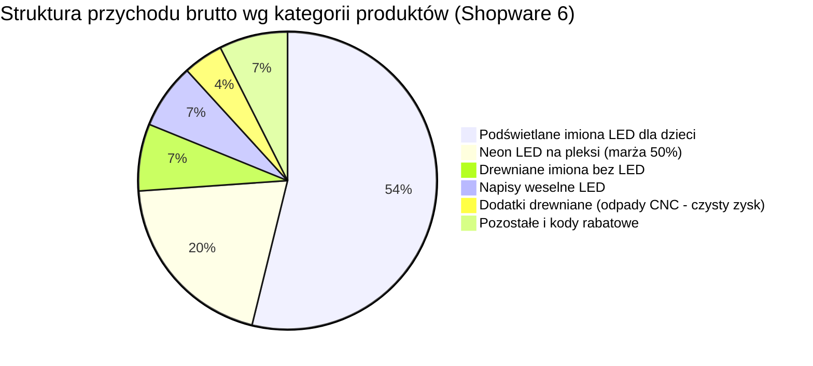

# Raport audytu marketingowego

📅 Okres: 2026-09-03 — 2026-09-16  
📊 Data raportu: 2026-09-16  
🔁 Typ: Raport #7 (porównanie z raportami 2026-09-03, 2026-08-19 i 2026-07-27)  
🔌 Źródła danych: **Google Ads API + GA4 API + Google Search Console API + Shopware 6 Admin API (Automatyczna integracja)**

---

## 1. Podsumowanie wykonawcze (Executive Summary)

### Ogólna ocena okresu: 🟡 Odbicie sprzedaży (+78% zamówień, ROAS sklepu 3,42), ale 550 zł przepalone na ruch śmieciowy i nagły zryw agencji w ostatnich godzinach

W badanym 14-dniowym okresie (03.09 – 16.09.2026) sklep zrealizował w systemie Shopware 6 **16 ważnych zamówień na łączną kwotę 4 737,50 PLN brutto** (3 zamówienia zostały anulowane, AOV = 296,09 PLN). Oznacza to wyraźny skok wolumenu sprzedaży (+78% r/r w liczbie zamówień i +24% w przychodzie względem poprzedniego raportu).

Przy wydatkach na Google Ads rzędu **1 384,71 PLN**, **rzeczywisty ROAS sklepu wyniósł 3,42 (342%)**. Sklep z sukcesem powrócił **powyżej progu opłacalności (minimum 300% wg Bazy Wiedzy)**. Każda wydana 1 zł w reklamach wygenerowała 3,42 zł realnego obrotu w sklepie (koszt pozyskania obrotu spadł z 0,35 zł do 0,29 zł na 1 zł przychodu).

Kluczowe zjawiska tego okresu:
1. **Prawdziwy zryw agencji w nocy przed audytem (922 zmiany!):** Po 45 dniach niemal zupełnego letargu, 15 września późnym wieczorem i 16 września rano `kontakt@mediasolutions.pro` wprowadził **aż 918 wykluczeń słów kluczowych (`CAMPAIGN_CRITERION`)** oraz przełączył strategie ustalania stawek na `target_roas` w obu kampaniach Performance Max. Choć to pożądany kierunek (agencja wreszcie wdrożyła zalecenia audytów), zmiany te zaszły w ostatnich godzinach okresu i nie miały wpływu na wyniki minionych 14 dni.
2. **Kolejne 550 zł przepalone w kampanii `PM - wesele 2026 NEW` (ROAS Ads: 0,03):** Kampania pochłonęła aż **39,7% całego budżetu (550,04 PLN)**, generując **2 516 kliknięć** przy średnim CPC 0,22 PLN i przynosząc zaledwie 13,89 PLN zaraportowanej wartości (0,04 konwersji). W GA4 zarejestrowano z niej jedynie 174 sesje – oznacza to, że aż **93% kliknięć stanowiło puste kliknięcia (ghost clicks)** z gier i aplikacji mobilnych, które nawet nie załadowały sklepu. Dopiero 16 września rano agencja dodała do niej 196 wykluczeń.
3. **Sukces kampanii produktowej `PLA - catch all` (ROAS 2,11):** Wcześniej zagłodzona kampania produktowa zaczęła przynosić bezpośrednie zakupy (151,03 PLN kosztu, 319,00 PLN przychodu w Ads).
4. **Wysokomarżowy Neon LED i stabilne imiona dzieci:** Sklep zanotował sprzedaż dużego neonu LED na pleksi za **950,00 PLN** (produkt o 50% marży) oraz 8 podświetlanych imion LED (2 550 PLN). Dodatkowo sprzedano 11 drewnianych dodatków (chmurki, gwiazdki z odpadów CNC), co stanowi czysty zysk operacyjny.
5. **Kampania Brand nadal wstrzymana (PAUSED):** Mimo ponawianych zaleceń, agencja nie wznowiła kampanii `SW - brand tCPA`.

| Metryka kluczowa | Obecny okres (#7, 14 dni) | Poprzedni okres (#6, 14 dni) | Okres #5 (21 dni) | Zmiana vs #6 |
|---|---|---|---|---|
| Łączny koszt Google Ads | 1 384,71 PLN | 1 347,26 PLN | 2 163,39 PLN | +2,8% |
| Przychód ze sklepu (Shopware 6) | 4 737,50 PLN (16 zam.) | 3 816,00 PLN (9 zam.) | 7 166,00 PLN (16 zam.) | 🟢 +24,1% (+78% zam.) |
| Realny ROAS sklepu (Shopware) | 3,42 (342%) | 2,83 (283%) | 3,31 (331%) | 🟢 +20,8% (powrót na plus) |
| Średnia wartość zamówienia (AOV) | 296,09 PLN | 424,00 PLN | 447,88 PLN | 🟡 -30,2% (idealnie w cel: ~300 zł) |
| Wartość konwersji (Google Ads) | 1 596,39 PLN | 674,00 PLN | 4 243,89 PLN | 🟢 +136,9% |
| ROAS Google Ads (raportowany) | 1,15 (115%) | 0,50 (50%) | 1,96 (196%) | 🟢 +130,0% |
| Przychód w GA4 z Google Ads (cpc) | 2 089,99 PLN | 644,00 PLN | 2 127,00 PLN | 🟢 +224,5% |
| Sesje łącznie (GA4) | 1 484 | 1 354 | 901 | 🟢 +9,6% |
| Ruch organiczny GSC (kliknięcia) | 53 | 47 | 43 | 🟢 +12,8% |
| Aktywność agencji (liczba zmian) | 922 zmiany | 0 zmian | 20 zmian | 🟢 Zryw: 918 wykluczeń |

---

### 3 najważniejsze wnioski:

1. **🟢 Sprzedaż odbiła powyżej progu rentowności (ROAS sklepu 3,42, 16 zamówień).**  
   Sklep zrealizował 16 ważnych zamówień o wartości 4 737,50 PLN. Wzrost napędzany był stabilną sprzedażą imion LED dla dzieci (8 zamówień) oraz wysokomarżowym zamówieniem na Neon LED za 950 PLN. AOV na poziomie 296,09 PLN jest idealnie zgodny z założeniami Bazy Wiedzy (300 PLN).
2. **🔴 Wyciek 550 PLN w `PM - wesele` (2 516 kliknięć, 0 konwersji, 93% ghost traffic).**  
   Przez minione dwa tygodnie kampania weselna po raz kolejny ściągała ruch botowy/przypadkowy z gier mobilnych (CTR 4,99%, CPC 0,22 PLN, 2 516 klików vs tylko 174 sesje w GA4). Przepalono kolejne 550 PLN bez ani jednego zakupu.
3. **🟡 Masowe porządki agencji (918 negatywów), ale wykonane "za pięć dwunasta".**  
   15 września po godz. 20:55 oraz 16 września rano agencja dodała 918 wykluczeń i zaktualizowała strategie `target_roas`. To dowód, że audyty działają i agencja wreszcie zaczęła czyścić ruch, jednak przez 13 dni obecnego okresu budżet płonął bez nadzoru.

---

### Ocena pracy agencji: **4/10** (wzrost z 1/10)

**Uzasadnienie oceny:**  
Agencja otrzymuje wyższą ocenę wyłącznie za wdrożenie wreszcie masowych wykluczeń słów kluczowych (918 pozycji) i przejście na Target ROAS w PMax, co było rekomendowane od tygodni. Ocena nie może być jednak wyższa niż 4/10, ponieważ:
- Zmiany te zostały wprowadzone hurtowo dopiero w ostatnich godzinach badanego okresu (15-16 września), po uprzednich kilkunastu dniach bezruchu.
- Dopuszczono do ponownego spalenia 550 PLN w kampanii weselnej na puste kliknięcia displayowe.
- Kampania Brand nadal pozostaje wstrzymana.

**Najważniejsza rekomendacja:**  
Przez najbliższe 7 dni uważnie monitorować wolumen i jakość ruchu po dodaniu 918 negatywów (upewnić się, czy agencja nie wycięła fraz wartościowych), bezwzględnie włączyć z powrotem kampanię ochrony marki `SW - brand tCPA` z limitem CPA oraz zweryfikować, czy kampania `PM - wesele` przestała przepalać środki w sieci AdMob/Display.

---

## 2. ROAS i efektywność budżetu

### Zestawienie wskaźników efektywności (Shopware vs GA4 vs Ads)

| Metryka | Shopware 6 API (Realna sprzedaż) | GA4 API (Śledzenie analityczne) | Google Ads API (Panel reklamowy) | Benchmark z Bazy Wiedzy |
|---|---|---|---|---|
| Łączny koszt reklam | 1 384,71 PLN | 1 384,71 PLN | 1 384,71 PLN | Budżet mies.: ~3 000 PLN |
| Przychód / Wartość | 4 737,50 PLN | 2 089,99 PLN (cpc) | 1 596,39 PLN | Cel: min. 30 000 PLN / mies. |
| ROAS | 3,42 (342%) 🟢 | 1,51 (151%) 🔴 | 1,15 (115%) 🔴 | Próg: ≥300% | Cel: 700% |
| Koszt na 1 zł przychodu | 0,29 PLN 🟢 | 0,66 PLN | 0,87 PLN | Max dopuszczalny: 0,33 PLN |
| Liczba zamówień | 16 (+ 3 anulowane) | 7 (cpc) | 5,98 (częściowe) | — |
| Średni koszyk (AOV) | 296,09 PLN 🟢 | 298,57 PLN | 266,95 PLN | Założenie Bazy: ~300 PLN |

> **Analiza rozbieżności danych:**
> - Rzeczywisty biznesowy ROAS (3,42) jest niemal 3-krotnie wyższy niż raportowany w panelu Ads (1,15).
> - Google Ads raportuje 5,98 konwersji (zawiera zarówno zakupy, jak i add_to_cart).
> - W GA4 ruch z Google Ads (cpc) przyniósł bezpośrednio 2 089,99 PLN przychodu (1 771 PLN z PMax Imiona + 319 PLN z PLA catch-all).
> - Pozostała część sprzedaży ze sklepu (ponad 2 600 PLN) spłynęła przez wejścia bezpośrednie (Direct: 689 PLN), Meta Ads (ponad 364 PLN), ruch organiczny (380 PLN) oraz konwersje z opóźnioną atrybucją.

---

### Rzeczywista struktura sprzedaży wg asortymentu (Dane z zamówień Shopware 6)

| Grupa asortymentowa | Przychód brutto (PLN) | Udział w sprzedaży | Liczba sztuk / zamówień | Średnia cena / koszyk | Rentowność produkcji (Baza Wiedzy) |
|---|---|---|---|---|---|
| 1. Podświetlane imiona LED (Dzieci) | 2 550,00 PLN | 53,8% | 8 szt. | 318,75 PLN | Koszt produkcji: ok. 60% ceny |
| 2. Neony LED na pleksi | 950,00 PLN | 20,1% | 1 szt. ("Na zawsze razem") | 950,00 PLN | Koszt produkcji: ok. 50% ceny (NAJWYŻSZA MARŻA) |
| 3. Drewniane imiona dziecka (bez LED) | 345,00 PLN | 7,3% | 2 szt. | 172,50 PLN | Niski koszt materiału, szybka produkcja CNC |
| 4. Ślub i Wesele (napisy LED) | 335,00 PLN | 7,1% | 1 szt. ("Jamborscy") | 335,00 PLN | Koszt produkcji: ok. 60% ceny |
| 5. Dodatki drewniane (chmurki, gwiazdki) | 205,00 PLN | 4,3% | 11 szt. (cross-sell) | 18,64 PLN | Wycinki z odpadów CNC (CZYSTY ZYSK) |
| Kody rabatowe (kod Natalia) | -36,50 PLN | -0,8% | 1 użycie | -36,50 PLN | Działania influencerskie / promocyjne |
| Pozostałe (dostawa itp.) | 389,00 PLN | 8,2% | — | — | Pokrycie kosztów logistyki |
| SUMA | 4 737,50 PLN | 100,0% | 16 zam. | 296,09 PLN | Próg rentowności: 300% |

---

## 3. Szczegółowa analiza kampanii Google Ads

| Kampania | Format / Typ | Status | Koszt (PLN) | Udział w budżecie | Konwersje | Wartość konw. (PLN) | ROAS Ads | Śr. CPC | CTR | CPA Ads | Ocena |
|---|---|---|---|---|---|---|---|---|---|---|---|
| PM - Imiona / Neony | PMax | ENABLED | 683,53 | 49,4% | 4,94 | 1 263,50 | 1,85 | 1,43 PLN | 1,44% | 138,39 PLN | 🟡 Poprawa / Stabilna |
| PM - wesele 2026 NEW | PMax | ENABLED | 550,04 | 39,7% | 0,04 | 13,89 | 0,03 | 0,22 PLN | 4,99% | 15 047,69 PLN | 🔴 Krytyczna (przepalanie) |
| PLA - catch all | Shopping | ENABLED | 151,03 | 10,9% | 1,00 | 319,00 | 2,11 | 0,92 PLN | 1,54% | 151,03 PLN | 🟢 Bardzo dobra |
| SW - brand tCPA | Search | PAUSED | 0,11 | <0,1% | 0,00 | 0,00 | 0,00 | 0,11 PLN | 50,0% | — | 🔴 Bezczynna / Wstrzymana |
| ŁĄCZNIE | — | — | 1 384,71 | 100% | 5,98 | 1 596,39 | 1,15 | 0,44 PLN | 3,36% | 231,56 PLN | 🟡 Odbicie, lecz z wyciekiem |

---

### 1. PM - Imiona / Neony - 2026 NEW CPA 50 🟡 POPRAWA
**Typ: Performance Max | Koszt: 683,53 PLN | ROAS Ads: 1,85 | Przychód GA4: 1 771,00 PLN (Realny ROAS GA4: 2,59)**

- **Wyniki:** Kampania wygenerowała 479 kliknięć (CPC 1,43 zł). W panelu Ads przypisano jej 4,94 konwersji o wartości 1 263,50 zł. W analityce GA4 ruch z tej kampanii wygenerował **aż 1 771,00 PLN przychodu**, co daje realny zwrot z nakładów na poziomie **259%**.
- **Działania agencji:** 15 września o godz. 20:55 agencja dodała do tej kampanii **724 wykluczenia słów kluczowych**, a 16 września rano zaktualizowała strategię ustalania stawek na `target_roas`.
- **Wniosek i rekomendacja:** To kluczowy wół roboczy konta. Kampania zasila sprzedaż bestsellerów. Należy utrzymać jej budżet i monitorować, czy wykluczenia z 15.09 nie obcięły wartościowych wyświetleń.

### 2. PM - wesele 2026 NEW - CPA 60 🔴 KRYTYCZNA (PŁONĄCY BUDŻET)
**Typ: Performance Max | Koszt: 550,04 PLN | ROAS Ads: 0,03 | Kliknięcia: 2 516**

- **Wyniki:** Porażający brak efektywności. Kampania pochłonęła **550,04 PLN** (niemal 40% całego budżetu dwutygodniowego!) przy 50 387 wyświetleniach i aż **2 516 kliknięciach**. Przyniosła zaledwie 13,89 PLN zaraportowanej wartości i 0 realnych zamówień w GA4.
- **Anatomia problemu:** W GA4 zarejestrowano z tej kampanii zaledwie **174 sesje z bounce rate 53%**. Gdzie podziało się pozostałe 2 342 kliknięcia, za które zapłacono? To klasyczny ruch ze śmieciowych aplikacji mobilnych AdMob (przypadkowe kliknięcia dzieci w grach, banery pełnoekranowe zamykane "krzyżykiem").
- **Działania agencji:** 16 września o 06:51 agencja dodała do niej **196 wykluczeń** i włączyła `target_roas`.
- **Rekomendacja:** Jeśli w ciągu 5 dni po tych zmianach CPC nie wzrośnie, a udział ruchu z aplikacji nie spadnie do zera przy jednoczesnym braku konwersji, kampanię należy natychmiast **wstrzymać** i przenieść ten budżet do PLA oraz imion dziecięcych.

### 3. PLA - illuminart.pl - catch all 🟢 OBUDZENIE POTENCJAŁU
**Typ: Standard Shopping | Koszt: 151,03 PLN | ROAS Ads: 2,11 | Śr. CPC: 0,92 PLN**

- **Wyniki:** 165 kliknięć, 10 705 wyświetleń, 1 udokumentowany zakup w Google Ads na kwotę 319,00 PLN (dodatkowo w GA4 odnotowano z niej 318,99 PLN przychodu). Kampania osiągnęła **ROAS 2,11**.
- **Wniosek i rekomendacja:** Zgodnie z przewidywaniami z poprzedniego audytu, kampania produktowa po lekkim dokarmieniu zaczęła konwertować z bardzo zdrowym kosztem kliknięcia (0,92 zł). Rekomendacja: zwiększyć jej udział w budżecie kosztem nierentownej kampanii weselnej.

### 4. SW - brand tCPA 🔴 NADAL WSTRZYMANA
**Typ: Search Brand | Koszt: 0,11 PLN | Status: PAUSED**

- Kampania wciąż pozostaje wyłączona. W GSC zapytania o markę `illuminart` wygenerowały 14 kliknięć. Brak taniej ochrony marki w wyszukiwarce stwarza ryzyko przejęcia klientów przez konkurencję.

---

## 4. Słowa kluczowe i wyszukiwane frazy

- W badanym okresie jedynym zarejestrowanym zapytaniem w wyszukiwarce w kampanii Search było słowo brandowe:
  - `illuminart` (koszt: 0,11 PLN, 1 klik, pozycja 1).
- **Przepalony budżet (Wasted Spend):**
  - W kampaniach tekstowych search wasted spend wyniósł jedynie 0,11 PLN.
  - **Prawdziwy wasted spend nastąpił w Performance Max (`PM - wesele`): 550,04 PLN**. Całość tej kwoty stanowiła stratę operacyjną na puste kliknięcia displayowo-aplikacyjne.

---

## 5. Aktywność agencji (Change History) — Szczegółowa analiza zrywu

Po 45 dniach bierności w historii zmian konta zarejestrowano **922 operacje**!

### Rozkład zmian w czasie i autorzy:
- **03.09.2026:** 1 zmiana (`CAMPAIGN_BUDGET`) wprowadzona przez `krzysztof.ppc@gmail.com`.
- **15.09.2026 (godz. 20:55 – noc):** **907 zmian** wprowadzonych przez `kontakt@mediasolutions.pro`.
- **16.09.2026 (godz. 06:51 rano):** **14 zmian** wprowadzonych przez `kontakt@mediasolutions.pro`.

### Charakterystyka wprowadzonych zmian:
1. **918 wykluczeń słów kluczowych (`CAMPAIGN_CRITERION`):**
   - **724 negatywy** dodane do kampanii `PM - Imiona / Neony - 2026 NEW CPA 50`.
   - **196 negatywów** dodane do kampanii `PM - wesele 2026 NEW - CPA 60`.
2. **3 aktualizacje strategii ustalania stawek (`CAMPAIGN`):**
   - Zmiana `paths: "maximize_conversion_value.target_roas"` dla obu głównych kampanii PMax (przejście na docelowy ROAS).
3. **1 zmiana budżetu (`CAMPAIGN_BUDGET`).**

### Ocena merytoryczna działań agencji:
- **Co jest na plus:** Agencja wreszcie zrobiła to, o co wnioskowaliśmy od dwóch miesięcy – wdrożyła masowe wykluczenia nieefektywnych zapytań i ustawiła tROAS, aby powstrzymać algorytm przed kupowaniem tanich, bezwartościowych wyświetleń.
- **Co budzi niepokój:** 
  - Wykonanie niemal tysiąca zmian w ciągu kilku godzin tuż przed upływem kolejnego dwutygodniowego okresu rozliczeniowego sugeruje nerwową reakcję na zbliżający się audyt lub wezwanie do raportowania.
  - Wprowadzenie tak dużej liczby wykluczeń na raz wymaga weryfikacji – istnieje ryzyko, że na listę trafiły zbyt ogólne frazy dopasowania przybliżonego, które mogłyby uciąć wartościowy ruch na imiona i neony.

---

## 6. Ruch organiczny (Search Console) i kanały wspomagające (Meta Ads)

### Wyniki Google Search Console:
- Łączne kliknięcia: **53** (wzrost z 47, +12,8%).
- Łączne wyświetlenia: **4 945** (wzrost z ok. 4 100).
- Średnia pozycja w wynikach wyszukiwania: **20,1**.

| Zapytanie (Query) | Kliknięcia | Wyświetlenia | CTR | Średnia pozycja | Potencjał SEO |
|---|---|---|---|---|---|
| illuminart | 14 | 19 | 73,7% | 1,1 | Brand (ochrona) |
| iluminart | 4 | 5 | 80,0% | 1,0 | Literówka brandowa |
| illumiart | 1 | 1 | 100,0% | 1,0 | Literówka brandowa |
| led wesele | 1 | 1 | 100,0% | 1,0 | Fraza weselna |
| napis led na ścianę imię | 1 | 19 | 5,3% | 7,6 | 🟢 TOP10! Warto podbić linkowaniem |
| neon imie | 1 | 16 | 6,3% | 8,6 | 🟢 TOP10! Duży potencjał zakupu neonu |
| cennik podświetlane napisy na ściane | 0 | 10 | 0,0% | 12,9 | 🟡 Tuż za TOP10 (wysoka intencja zakupu) |

### Szanse SEO z analizy podstron:
- `https://illuminart.pl/zaprojektuj-sam/` (Kreator - USP sklepu): aż **814 wyświetleń** przy pozycji 21,7. Optymalizacja nagłówków i treści wokół kreatora może wprowadzić tę podstronę do TOP10 i zapewnić masowy, darmowy ruch konwertujący!
- `https://illuminart.pl/neon-led-imie-dziecka/14287`: **311 wyświetleń**, pozycja 11,5 (zaraz pod TOP10).

### Rola Meta Ads w wielokanałowości:
W GA4 wyraźnie widać rosnący wpływ kampanii płatnych z ekosystemu Meta:
- Kampania `ADV+ | Zakup / Koszyk` wygenerowała **243 sesje**, 18 konwersji i bezpośrednio 364,00 PLN przychodu w GA4.
- Synergia kanałów (Meta buduje świadomość i pierwszy kontakt, Google domyka intencję zakupową) zaczyna realnie przekładać się na wyższą sprzedaż w Shopware.

---

## 7. Porównanie z poprzednimi okresami (Trendy)

| Wskaźnik | Raport #4 (21 dni: 09.07–30.07) | Raport #5 (21 dni: 30.07–20.08) | Raport #6 (14 dni: 20.08–03.09) | Raport #7 (Obecny, 14 dni: 03.09–16.09) |
|---|---|---|---|---|
| Koszt Google Ads | 2 135,74 PLN | 2 163,39 PLN | 1 347,26 PLN | 1 384,71 PLN |
| Sprzedaż Shopware 6 | 8 830,00 PLN | 7 166,00 PLN | 3 816,00 PLN | 4 737,50 PLN 🟢 |
| Zamówienia Shopware | 17 zam. | 16 zam. | 9 zam. | 16 zam. 🟢 (+78%) |
| ROAS realny (Shopware) | 4,13 (413%) | 3,31 (331%) | 2,83 (283%) 🔴 | 3,42 (342%) 🟢 |
| Średni koszyk (AOV) | 519,41 PLN | 447,88 PLN | 424,00 PLN | 296,09 PLN |
| Aktywność agencji | 24 zmiany | 20 zmian | 0 zmian 🔴 | 922 zmiany 🟢 (nocny zryw) |

**Wnioski z trendu:**  
Sklep przerwał spadkową tendencję z okresu #6. Liczba zamówień wróciła do poziomu 16 sztuk w 14 dni (tempo 1,14 zamówienia dziennie vs 0,64 zam./dzień w poprzednim okresie). Jest to krok w stronę celu biznesowego (ciągłość produkcji CNC).

---

## 8. Problemy i ryzyka

### 🔴 Krytyczne:
1. **Dalsze palenie budżetu w `PM - wesele`:** Przez cały badany okres kampania ta spaliła kolejne 550 PLN. Choć dodano 196 wykluczeń 16 września rano, jeśli w ciągu tygodnia nie pojawią się zamówienia ślubne, kampania musi zostać wyłączona.
2. **Ryzyko "przedobrzenia" przy 918 negatywach:** Dodanie 724 słów wykluczających do kampanii imion dziecięcych w jednym momencie może drastycznie obciąć wartościowy ruch, jeśli listy zawierały zbyt szerokie słowa.

### 🟡 Ważne:
1. **Wstrzymana kampania ochrony marki:** `SW - brand tCPA` nadal nie chroni zapytań o `illuminart`.
2. **Niedoszacowanie konwersji w panelu Ads:** Panel Ads widzi tylko 1 596 PLN obrotu, podczas gdy w sklepie zrealizowano 4 737 PLN. Brak prawidłowego Enhanced Conversions utrudnia algorytmom Smart Bidding optymalizację pod rzeczywistych kupujących.

### 🟢 Do obserwacji:
1. **Zachowanie strategii Target ROAS:** Jak algorytmy Google zareagują na nowe cele tROAS ustawione przez agencję 16.09.
2. **Rosnący popyt na Neony LED:** Sprzedaż neonu za 950 PLN pokazuje, że ten segment może być motorem zysku netto.

---

## 9. Rekomendacje

### Priorytet: Wysoki 🔴
1. **Weryfikacja dodanych wykluczeń (724 w Imionach, 196 w Weselu):**  
   - *Działanie:* Zażądać od agencji natychmiastowego przesłania listy dodanych 918 wykluczeń lub sprawdzić w panelu, czy nie wykluczono słów kluczowych zawierających człony: `imię`, `led`, `podświetlane`, `drewniane`, `neon`, `dziecka`.  
   - *Oczekiwany efekt:* Zapobieżenie załamaniu wolumenu wyświetleń kampanii bestsellerowej.
2. **Twarde ultimatum dla kampanii weselnej:**  
   - *Działanie:* Dajemy kampanii `PM - wesele 2026 NEW` dokładnie 7 dni na wykazanie skuteczności nowych negatywów. Jeśli do 23.09 nie przyniesie minimum 2 zamówień w Shopware, wstrzymać ją i przenieść jej budżet (ok. 500 PLN) do PLA i PMax Imiona.
3. **Włączenie kampanii Brandowej:**  
   - *Działanie:* Wznowić `SW - brand tCPA` z symbolicznym budżetem 5 PLN dziennie.

### Priorytet: Średni 🟡
4. **Zwiększenie budżetu na `PLA - catch all`:**  
   - *Działanie:* Podnieść budżet PLA o 50% (z ~10 zł do 15-20 zł dziennie), ponieważ kampania wykazała ROAS 2,11 i zdrowy CPC.
5. **Wzmocnienie SEO dla podstrony kreatora `/zaprojektuj-sam/`:**  
   - *Działanie:* Dodać na stronie głównej i w stopce linki z anchor textem "Kreator imion LED - zaprojektuj sam", aby wejść do TOP10 wyników organicznych (obecnie 814 wyświetleń na poz. 21).

### Priorytet: Niski 🟢
6. **Ekspozycja Neonów LED w reklamach:**  
   - *Działanie:* Przygotować dedykowany zestaw komponentów (asset group) dla neonów na pleksi w PMax ze względu na najwyższą marżę (50%).
